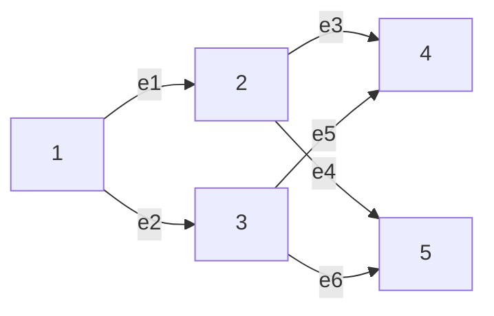

# OptimShortestPaths.jl Cheat Sheet

A practical, example-driven guide to the most commonly used functions. It starts from single-source shortest paths, builds up through utilities and bounded variants, covers multi-objective methods, and ends with domain-specific pharma helpers. Each example includes detailed explanation so you understand the variables, setup, and rationale.

## Table of Contents

- [Quick Start](#quick-start)
- [Core Shortest Path](#core-shortest-path)
- [Path Helpers](#path-helpers)
- [Graph Utilities](#graph-utilities)
- [Analysis & Comparison](#analysis--comparison)
- [Bounded & Internals (Advanced)](#bounded--internals-advanced)
- [Preference & Connectivity](#preference--connectivity)
- [Multi-Objective Shortest Paths (MOSP)](#multi-objective-shortest-paths-mosp)
- [Pharma Conveniences (Domain Wrappers)](#pharma-conveniences-domain-wrappers)
- [End-to-End Example: Generic Graph Walkthrough](#end-to-end-example-generic-graph-walkthrough)
- [Comprehensive Function Reference (Cheat Sheet Tables)](#comprehensive-function-reference-cheat-sheet-tables)
- [Detailed Output Keys (Analysis Functions)](#detailed-output-keys-analysis-functions)
- [Constraints & Assumptions Cheatsheet](#constraints--assumptions-cheatsheet)
- [Typical Pitfalls & Remedies](#typical-pitfalls--remedies)
- [Complexity Snapshot](#complexity-snapshot)

## Quick Start

- Load the package from the repo root:

```julia
include("src/OptimShortestPaths.jl"); using .OptimShortestPaths  # load local module file and bring exported APIs into scope
```

Explanation:
- `include("src/OptimShortestPaths.jl")` loads the module file directly from the source path so you can use it without installing a package.
- `using .OptimShortestPaths` brings the module’s exported functions and types into the current namespace; the leading dot (`.`) means “use the module defined in this local file”.
- After this, you can call constructors like `Edge`, `DMYGraph`, and algorithms like `dmy_sssp!`.

## Core Shortest Path

- `DMYGraph(n_vertices, edges, weights)`: Create a directed graph.
- `dmy_sssp!(graph, source)`: Single-source shortest path distances.
- `dmy_sssp_with_parents!(graph, source)`: Distances + parent array for paths.
- `find_shortest_path(graph, source, target)`: Returns `(distance, path)`.

Example:

Problem Statement:
- Goal: Compute single-source shortest paths minimizing the sum of non-negative edge weights.
- Input: Directed graph `DMYGraph` with aligned `edges` and `weights`, source vertex `1`.
- Output: Distance vector from `1` to all vertices and the shortest path from `1` to target `4`.
- Assumptions: All weights ≥ 0; vertices are `1..n`; `edges[i].index == i` to align with `weights[i]`.
- Rationale: Use DMY for efficient SSSP on sparse graphs and parent pointers to reconstruct paths.

```julia
# 1) Build a simple directed graph (each line includes why)
edges   = [
    Edge(1, 2, 1),  # edge from 1->2; index=1 must equal position 1 so weights[1] maps here
    Edge(2, 3, 2),  # edge from 2->3; index=2 aligns with position 2 and weights[2]
    Edge(1, 3, 3),  # edge from 1->3; index=3 aligns with position 3 and weights[3]
    Edge(3, 4, 4),  # edge from 3->4; index=4 aligns with position 4 and weights[4]
]
weights = [
    1.0,  # cost of edge[1] (1->2); non-negative for DMY requirements
    1.0,  # cost of edge[2] (2->3);
    3.0,  # cost of edge[3] (1->3);
    2.0,  # cost of edge[4] (3->4);
]
graph   = DMYGraph(4, edges, weights)  # constructs adjacency lists and validates index/weight alignment

# 2) Compute distances
dist = dmy_sssp!(graph, 1)  # run DMY from source=1; dist[v] is shortest distance or INF if unreachable

# 3) Distances + parents, and a path query
(dist2, parent) = dmy_sssp_with_parents!(graph, 1)  # also returns parent[v] to reconstruct paths
(distance, path) = find_shortest_path(graph, 1, 4)  # convenience: returns (distance, vertex path)
```

Explanation:
- `edges`: A vector of `Edge` structs; each edge has `(source, target, index)` where `index` must match its position to align with `weights`.
- `weights`: A vector of non-negative floats; `weights[i]` is the cost of `edges[i]`. Non-negative weights are required for DMY.
- `graph = DMYGraph(4, edges, weights)`: Builds the adjacency list internally, validates indices, and ensures lengths match.
- `dist = dmy_sssp!(graph, 1)`: Runs the DMY single-source shortest path from vertex 1; returns a distance vector where `dist[v]` is the shortest distance from 1 to `v` or `INF` if unreachable.
- `dmy_sssp_with_parents!`: Same as above but also returns `parent` pointers for path reconstruction.
- `find_shortest_path(graph, 1, 4)`: Helper that internally uses the parents to reconstruct and return the `(distance, path)` from 1 to 4.

Note: Edge Index and Weights Alignment (Why and How)
- What `index` means: it’s the 1-based ID of an edge and must equal the edge’s position in `graph.edges`. So `edges[i].index == i` is required.
- Why this setup: adjacency lists store edge IDs (integers), not weights or neighbor tuples. During relaxation, the algorithm fetches both the edge and its weight via the same ID for O(1) aligned access:
  - `edge = graph.edges[edge_idx]` and `weight = graph.weights[edge_idx]` where `edge_idx` comes from `graph.adjacency_list[u]`.
- Invariants ensured by `DMYGraph` constructor:
  - `length(weights) == length(edges)`; every edge has exactly one weight.
  - `edges[i].index == i`; keeps edges and weights synchronized.
  - `graph.adjacency_list[u]` contains valid edge indices and the edge’s `source` equals `u`.
- Performance rationale: separating `edges` (structs) from `weights` (plain floats) improves memory locality and numeric operations; the index guarantees a fast, consistent mapping.
- Correct vs incorrect:
```julia
# Correct: indices match positions
edges   = [Edge(1,2,1), Edge(1,3,2)]
weights = [0.5, 1.2]
graph   = DMYGraph(3, edges, weights)  # OK

# Incorrect: indices swapped
edges   = [Edge(1,2,2), Edge(1,3,1)]
weights = [0.5, 1.2]
graph   = DMYGraph(3, edges, weights)  # ERROR: Edge index mismatch at position 1
```

## Path Helpers

- `reconstruct_path(parent, source, target)`: Rebuild path from parents.
- `shortest_path_tree(parent, source)`: Map each reachable vertex → path.
- `path_length(path, graph)`: Sum weights along the path.
- `format_distance_results(dist, source)`: Pretty-print distances.

Example:

Problem Statement:
- Goal: Given distances and parent pointers from a DMY run, reconstruct paths for each reachable vertex, verify lengths, and present a human-readable report.
- Input: `parent` array produced by `dmy_sssp_with_parents!` and the original `graph`.
- Output: Dictionary of vertex → path from source, path lengths, and formatted distance summary.
- Rationale: Path reconstruction makes results inspectable and validates that computed distances match edge-weight sums.

```julia
# Build a shortest-path tree and inspect
tree = shortest_path_tree(parent, 1)
@show tree[4]                      # [1, 2, 3, 4]
@show path_length(tree[4], graph)  # 4.0

println(format_distance_results(dist, 1))
# Shortest distances from vertex 1:
# ========================================
# Vertex 1: 0.0
# Vertex 2: 1.0
# Vertex 3: 2.0
# Vertex 4: 4.0
# ========================================
# Reachable vertices: 4 / 4
```

Explanation:
- `shortest_path_tree(parent, 1)`: Iterates over all vertices, calling `reconstruct_path` to build the path from source 1; returns a dictionary mapping each reachable vertex to its path.
- `tree[4]`: Retrieves the path `[1, 2, 3, 4]` for vertex 4.
- `path_length(tree[4], graph)`: Validates the edges exist and sums their weights; returns `INF` if any hop is missing.
- `format_distance_results(dist, 1)`: Produces a readable, line-by-line report, including unreachable vertices and a reachability summary.

## Graph Utilities

- Validation and basics:
  - `validate_graph(graph)`: Structural checks (indices, sizes, non-negative finite weights).
  - `create_simple_graph(n_vertices, [(u, v, w), ...])`: Quick builder.
  - `vertex_count`, `edge_count`, `out_degree`, `outgoing_edges`: Structure stats.
  - `find_edge`, `get_edge_weight_between`, `is_connected`: Edge queries.
- Reachability and stats:
  - `graph_reachability(graph, source)`: BFS-style reachability set.
  - `graph_statistics(graph)`: Density, degree extremes, weight stats.

Example:

Problem Statement:
- Goal: Validate graph structural integrity and inspect basic properties before computation.
- Input: A constructed `DMYGraph` (from the core example) and a simple graph `g2` built from tuples.
- Output: Validation result (or errors), degree counts, reachability set, and structural statistics.
- Rationale: Precondition checks ensure algorithm correctness; metrics help understand graph shape and expected performance.

```julia
validate_graph(graph)                         # throws on invalid structure

# Quick builder
g2 = create_simple_graph(3, [(1,2,0.5), (2,3,1.0)])

@show out_degree(graph, 1)                    # 2
@show get_edge_weight_between(graph, 1, 3)    # 3.0
reachable = graph_reachability(graph, 1)      # Set([1, 2, 3, 4])
stats = graph_statistics(graph)               # Dict with density/degree/weight stats
```

Explanation:
- `validate_graph(graph)`: Ensures the adjacency list matches edges, all weights are finite/non-negative, and indices are consistent.
- `create_simple_graph(3, ...)`: Converts tuple input into `Edge` and `weights` vectors automatically; useful for quick tests.
- `out_degree(graph, 1)`: Counts outgoing edges for vertex 1.
- `get_edge_weight_between(graph, 1, 3)`: Returns the first matching edge weight or `nothing` if missing; here `3.0`.
- `graph_reachability(graph, 1)`: Performs a simple BFS ignoring weights to find all vertices reachable from 1.
- `graph_statistics(graph)`: Reports structural metrics: edge count, density, min/max/avg out-degree, weight statistics.

## Analysis & Comparison

- `verify_shortest_path(graph, dist, source, target)`: Triangle inequality sanity check.
- `compare_with_dijkstra(graph, source)`: DMY vs reference Dijkstra.

Example:

Problem Statement:
- Goal: Verify that DMY distances satisfy shortest-path properties and compare against a reference Dijkstra implementation.
- Input: A graph and the distance vector `dist` computed by DMY from the chosen source.
- Output: Boolean verification for selected pairs and a comparison dictionary with timing and max difference.
- Rationale: Sanity-check correctness; quantify agreement with a known baseline.

```julia
@assert verify_shortest_path(graph, dist, 1, 4)
cmp = compare_with_dijkstra(graph, 1)
@show cmp["results_match"], cmp["max_difference"], cmp["speedup"]
```

Explanation:
- `verify_shortest_path`: Checks that for all `u` with an edge to `target`, `dist[target] ≤ dist[u] + w(u,target)` within tolerance; confirms the computed distance is consistent.
- `compare_with_dijkstra(graph, 1)`: Runs DMY and a simple Dijkstra, then returns a dictionary with timing and distance differences; `results_match` should be true and `max_difference` ~ 0 within float tolerance.
- `speedup`: Ratio `dijkstra_time / dmy_time`; note tiny times can produce noisy ratios, so trust correctness metrics first.

## Bounded & Internals (Advanced)

- `dmy_sssp_bounded!(graph, source, max_distance)`: Only within distance threshold.
- `calculate_pivot_threshold(U_size)`: k = `ceil(U_size^(1/3))`.
- `calculate_partition_parameter(n)`: t = `ceil(log(n)^(1/3))`.
- `dmy_algorithm_statistics(graph, source)`: Run + summary metrics.

Example:

Problem Statement:
- Goal: Limit computation to paths within a maximum distance and collect algorithm statistics for analysis/tuning.
- Input: Graph, source vertex, bound `max_distance`.
- Output: Bounded distance vector (INF beyond bound) and a statistics dictionary including runtime and parameters.
- Rationale: Bounding reduces needless exploration; instrumentation reveals behavior and settings.

```julia
bounded = dmy_sssp_bounded!(graph, 1, 2.5)           # [0.0, 1.0, 2.0, INF]
algo_stats = dmy_algorithm_statistics(graph, 1)
@show algo_stats["runtime_seconds"], algo_stats["pivot_threshold"]
```

Explanation:
- `dmy_sssp_bounded!`: Sets the bound `B = max_distance` and ensures relaxations never exceed it; distances beyond the bound remain `INF`.
- `bounded` result shows only vertices within 2.5 are assigned finite distances.
- `dmy_algorithm_statistics`: Validates and runs the algorithm, capturing execution time, graph size, and the theoretical pivot/partition parameters derived from `n`.

Note: The internals (BMSSP relaxation, pivot selection, block partitioning) are orchestrated via `recursive_layer!` under `dmy_sssp!`; you typically won’t call them directly unless instrumenting the algorithm.

## Preference & Connectivity

- `calculate_distance_ratio(graph, source, target1, target2)`: Ratio `dist(target1)/dist(target2)` with robust `INF` handling.
- `calculate_path_preference(graph, source, preferred, alternative)`: Inverse ratio (higher → preferred is closer).
- `find_reachable_vertices(graph, source, max_distance=INF)`: Vertices within threshold.
- `analyze_connectivity(graph, source)`: Counts + mean/min/max distances.
- `compare_sources(graph, sources, target)`: Per-source distance map.

Example:

Problem Statement:
- Goal: Quantify preference between two targets, list vertices reachable within a threshold, summarize connectivity, and compare multiple sources to a single target.
- Input: Graph, source(s), target(s), and optional distance threshold.
- Output: Distance ratio and inverse preference score, reachable vertex list, connectivity metrics, and source→target distance map.
- Rationale: Support selection and planning decisions with interpretable metrics based on shortest-path distances.

```julia
ratio = calculate_distance_ratio(graph, 1, 2, 3)    # 1.0 / 2.0 = 0.5
pref  = calculate_path_preference(graph, 1, 3, 2)   # inverse of ratio = 2.0
nearby = find_reachable_vertices(graph, 1, 2.0)     # [1, 2, 3]
metrics = analyze_connectivity(graph, 1)            # Dict with connectivity stats
sources = [1, 2]; target = 4
map = compare_sources(graph, sources, target)       # Dict(1=>4.0, 2=>3.0)
```

Explanation:
- `calculate_distance_ratio`: Computes a relative reachability metric; handles cases where either target is `INF` (unreachable) gracefully.
- `calculate_path_preference`: Uses inverse ratio so lower distance → higher preference score for the `preferred` target.
- `find_reachable_vertices`: Filters all vertices whose computed distance ≤ `max_distance`.
- `analyze_connectivity`: Produces summary stats: how many reachable, mean distance over reachable, min distance (excluding zero), and max distance.
- `compare_sources`: Runs shortest paths from each source and returns a `Dict(source => dist_to_target)` so you can pick the best source.

## Approach Selection Guide

- Shortest Path (single objective):
  - Use `dmy_sssp!` for large, sparse graphs; validate with `compare_with_dijkstra`.
  - Use `dmy_sssp_bounded!` when only near-neighborhoods matter to limit work.

- Multi-Objective (trade-offs):
  - Weighted Sum (`weighted_sum_approach`):
    - Combine objectives into one cost with weights; fast but may miss non-convex Pareto points.
    - Requires all objectives expressed as costs (`:min`). Transform maximize metrics first.
  - Epsilon Constraint (`epsilon_constraint_approach`):
    - Optimize a primary objective with one-sided bounds on others.
    - For two-sided ranges, filter `compute_pareto_front` by lower/upper bounds, then select by primary objective.
  - Lexicographic (`lexicographic_approach`):
    - Strict priority ordering (e.g., cost → toxicity → efficacy); keeps edges that preserve optimality at each level.
    - Requires cost-type objectives (`:min`).
  - Knee Point (`get_knee_point`):
    - Heuristic to pick the best trade-off after normalizing objectives; good default when no strict preferences.

- Domain Wrappers:
  - Use `Pharma` convenience functions (`create_drug_target_network`, `create_metabolic_pathway`, `create_treatment_protocol`) to build graphs from domain data and then apply generic utilities.

## Multi-Objective Shortest Paths (MOSP)

- Data structures:
  - `MultiObjectiveGraph`, `MultiObjectiveEdge`, `ParetoSolution`.
- Core:
  - `compute_pareto_front(mog, source, target; max_solutions=100)`: Enumerates non-dominated path labels.
- Scalarization and selection:
  - `epsilon_constraint_approach(mog, source, target, primary_objective, constraints)`: Filter by constraints, then choose best on primary objective.
  - `lexicographic_approach(mog, source, target, priority_order)`: Optimize objectives in priority order (requires cost-type objectives).
  - `weighted_sum_approach(mog, source, target, weights)`: Reduce to single objective (requires all objectives as costs).
  - `get_knee_point(pareto_front)`: Heuristic best trade-off.

Example (build a small multi-objective graph):

Problem Statement:
- Goal: Find Pareto-optimal paths between `source` and `target` across three objectives: efficacy (maximize), toxicity (minimize), and cost (minimize).
- Input: `MultiObjectiveGraph` with edges carrying 3 objective values per edge; in the example, `source = 1` and `target = 5` for clarity.
- Output: A Pareto front of non-dominated solutions, a knee-point trade-off solution, and a constrained-best solution with toxicity ≤ 0.25 and cost ≤ 80 optimizing cost.
- Assumptions: Objective senses are `[:max, :min, :min]`; path objectives are component-wise sums; dominance respects per-objective sense.
- Rationale: Label-setting enumerates non-dominated paths; knee-point selects a balanced trade-off; epsilon constraints focus on feasible regions.

Topology (example graph):



ASCII fallback (compact):
```
[1]─(e1)→[2]─(e3)→[4]
 │       └(e4)→[5]
 └(e2)→[3]─(e5)→[4]
         └(e6)→[5]
```

Edge legend:
- e1: `[0.8, 0.2, 100.0]`   (efficacy, toxicity, cost)
- e2: `[0.5, 0.1, 200.0]`
- e3: `[0.9, 0.3, 50.0]`
- e4: `[0.7, 0.4, 75.0]`
- e5: `[0.6, 0.1, 80.0]`
- e6: `[0.8, 0.15, 60.0]`
Adjacency summary:
- `adj[1] == [1, 2]` (edges 1 and 2 start at 1)
- `adj[2] == [3, 4]` (edges 3 and 4 start at 2)
- `adj[3] == [5, 6]` (edges 5 and 6 start at 3)
- `adj[4] == []`, `adj[5] == []` (no outgoing edges)

```julia
using OptimShortestPaths: MultiObjectiveGraph, MultiObjectiveEdge,               # import MO types
                          compute_pareto_front, epsilon_constraint_approach, get_knee_point  # import MO algorithms

# Topology: 5 vertices total; source=1 chooses between 2 or 3, then reaches 4 or 5.
# Objectives per edge: [efficacy (maximize), toxicity (minimize), cost (minimize)].
edges_mo = [
    MultiObjectiveEdge(1, 2, [0.8, 0.2, 100.0], 1),  # high efficacy to 2; moderate toxicity; medium cost; id=1
    MultiObjectiveEdge(1, 3, [0.5, 0.1, 200.0], 2),  # lower efficacy to 3; lower toxicity; higher cost; id=2
    MultiObjectiveEdge(2, 4, [0.9, 0.3, 50.0], 3),   # strong efficacy via 2->4; higher tox; low cost; id=3
    MultiObjectiveEdge(2, 5, [0.7, 0.4, 75.0], 4),   # decent efficacy via 2->5; higher tox; medium cost; id=4
    MultiObjectiveEdge(3, 4, [0.6, 0.1, 80.0], 5),   # moderate efficacy via 3->4; low tox; medium-high cost; id=5
    MultiObjectiveEdge(3, 5, [0.8, 0.15, 60.0], 6),  # good efficacy via 3->5; low-moderate tox; lower cost; id=6
]

# Build adjacency lists so each vertex knows its outgoing MO edge indices.
adj = [Int[] for _ in 1:5]                            # one outgoing list per vertex
for (i, e) in enumerate(edges_mo)
    push!(adj[e.source], i)                           # store the i-th edge index under its source vertex
end

# Construct the multi-objective graph.
mog = MultiObjectiveGraph(
    5,                    # number of vertices
    edges_mo,             # MO edges with 3 objective values each
    3,                    # number of objectives (efficacy, toxicity, cost)
    adj,                  # adjacency of MO edge indices
    ["efficacy", "toxicity", "cost"],
    objective_sense=[:max, :min, :min],  # specify which objectives to maximize vs minimize
)

# Enumerate Pareto-optimal paths from source=1 to target=5.
pareto = compute_pareto_front(mog, 1, 5)              # returns non-dominated solutions with (objectives, path)

# Pick a balanced solution (“knee point”) among the Pareto front.
knee   = get_knee_point(pareto)                        # heuristic: farthest from utopia-nadir line after normalization
@show knee.objectives, knee.path                       # inspect the chosen trade-off and its vertex path

# Constrained selection: keep only solutions with toxicity ≤ 0.25 and cost ≤ 80. Primary objective to optimize = cost (index 3).
best = epsilon_constraint_approach(mog, 1, 5, 3, [Inf, 0.25, 80.0])
@show best.objectives, best.path                       # inspect constrained-best by primary objective
```

Explanation:
- `edges_mo`: Each `MultiObjectiveEdge` carries a 3-vector `[efficacy, toxicity, cost]`; these are per-edge objective contributions.
- `adj`: A per-vertex list of outgoing multi-objective edge indices; used for label expansion.
- `objective_sense=[:max, :min, :min]`: Efficacy is a maximize objective; toxicity and cost are minimize.
- `compute_pareto_front(mog, 1, 5)`: Performs label-setting expansion from source 1 to target 5, storing only non-dominated labels (paths) at each vertex.
- `get_knee_point(pareto)`: Normalizes objectives and selects a “knee” solution with a strong trade-off across objectives.
- `epsilon_constraint_approach(..., primary_objective=3, constraints=[Inf, 0.25, 80.0])`: Filters Pareto solutions to those with toxicity ≤ 0.25 and cost ≤ 80, then picks the best on the primary objective (cost).

### Two-Sided Constraints (Objective Ranges)

Problem Statement:
- Goal: Select the best path subject to two-sided bounds per objective (e.g., toxicity within [0.2, 0.35] and cost ≤ 80) while optimizing a primary objective.
- Input: `lower_bounds` and `upper_bounds` arrays of length `mog.n_objectives`. Use `-Inf`/`Inf` to leave sides unbounded.
- Output: The best `ParetoSolution` that satisfies all ranges, chosen by the primary objective’s sense.
- Rationale: The built-in `epsilon_constraint_approach` applies one-sided constraints; for two-sided bounds, filter the Pareto front and then select by the primary objective.

Example:

```julia
# Define two-sided bounds per objective:
# [efficacy, toxicity, cost]
lower_bounds = [-Inf, 0.20, -Inf]   # toxicity must be ≥ 0.20 (example); others unbounded below
upper_bounds = [ Inf, 0.35, 80.0]   # toxicity ≤ 0.35; cost ≤ 80.0; efficacy unbounded above

tol = 1e-10  # numerical tolerance for comparisons

# Compute Pareto front from source=1 to target=5
pareto = compute_pareto_front(mog, 1, 5)

# Helper to check range with tolerance
in_range(val, lb, ub, tol) = (val >= lb - tol) && (val <= ub + tol)

# Filter solutions that satisfy all two-sided bounds
valid = [
    sol for sol in pareto
    if all(in_range(sol.objectives[i], lower_bounds[i], upper_bounds[i], tol)
            for i in 1:mog.n_objectives)
]

if isempty(valid)
    # No solution meets constraints; handle as needed
    best_range_sol = ParetoSolution(fill(Inf, mog.n_objectives), Int[], zeros(Int, mog.n_vertices))
else
    primary = 3  # optimize cost (index 3); change as needed
    scores = [sol.objectives[primary] for sol in valid]
    best_idx = mog.objective_sense[primary] === :min ? argmin(scores) : argmax(scores)
    best_range_sol = valid[best_idx]
end

@show best_range_sol.objectives, best_range_sol.path
```

Notes:
- Two-sided bounds apply to the achieved objective values directly, irrespective of `:min`/`:max`. The sense only affects how you select the “best” among feasible solutions (minimize or maximize the primary objective).
- You can mix ranges across objectives (e.g., efficacy ∈ [0.6, 0.9], toxicity ≤ 0.3, cost ∈ [20, 70]).
- If you routinely need two-sided bounds, consider wrapping this pattern in a helper function.
Notes:
- For `weighted_sum_approach` or `lexicographic_approach`, all objectives must be expressed as costs (`:min`). Transform maximize objectives appropriately (e.g., `cost = 1.0 - efficacy` or a normalized negative) before calling.

## Pharma Conveniences (Domain Wrappers)

- `create_drug_target_network(drugs, targets, interactions)`: Builds a bidirectional graph with normalized distances from binding affinities (safe for values > 1.0).
- `find_drug_target_paths(network, drug, target)`: Returns `(distance, names_path)`.
- `analyze_drug_connectivity(network, drug)`: Reachability and distance stats across targets.
- `create_metabolic_pathway(metabolites, reactions, costs, reaction_network)`: Directed reaction edges with costs.
- `find_metabolic_pathway(pathway, start, end)`: Returns `(total_cost, names_path)`.
- `create_treatment_protocol(treatments, costs, efficacy_weights, transitions)`: Combined cost = `transition_cost + costs[to] / max(efficacy[to], 1e-6)`.
- `optimize_treatment_sequence(protocol, start, end)`: Returns `(total_cost, treatment_sequence)`.

Example (drug-target):

Problem Statement:
- Goal: Build a drug-target interaction network from an affinity matrix, find the shortest path from a named drug to a named target, and analyze connectivity for that drug.
- Input: Drug names, target names, and a non-negative affinity matrix (drug × target).
- Output: Shortest-path distance and sequence of names from the drug to the target; connectivity statistics for the drug.
- Assumptions: Affinities ≥ 0; converted to distances via `-log(a/(1+a))` to ensure non-negative weights while preserving ordering.
- Rationale: Transform pharmacological binding strengths into metric costs suitable for shortest-path algorithms.

```julia
drugs    = ["Aspirin", "Ibuprofen"]             # drug names -> vertices 1..length(drugs)
targets  = ["COX1", "COX2"]                     # target names -> vertices after drug block
interact = [1.0 0.2; 0.5 0.8]                     # affinity matrix (drug × target); non-zero creates edges
network  = create_drug_target_network(drugs, targets, interact)  # converts affinity to distance via -log(a/(1+a))

(distance, path_names) = find_drug_target_paths(network, "Aspirin", "COX2")  # shortest path from drug to target
analysis = analyze_drug_connectivity(network, "Aspirin")                       # reachability/summary from this drug
@show distance, path_names, analysis["reachable_targets"], analysis["avg_target_distance"]
```

Explanation:
- `drugs`, `targets`: Names mapped to vertex IDs; drugs first, then targets, to form a single graph.
- `interact`: A `length(drugs) × length(targets)` matrix of affinities; non-zero values create edges both ways (drug→target and target→drug).
- `create_drug_target_network`: Normalizes affinity to distance via `-log(affinity/(1+affinity))` to guarantee non-negative weights while preserving ordering.
- `find_drug_target_paths`: Solves for shortest path from a named drug to a named target; returns numeric distance and a names sequence.
- `analyze_drug_connectivity`: Runs SSSP from a drug vertex and summarizes how many targets are reachable and the distribution of target distances.

Example (metabolic + treatment):

Problem Statement:
- Metabolic Pathway:
  - Goal: Find a minimum-cost sequence of metabolites from a start to an end metabolite.
  - Input: Metabolite names, reaction names and costs, and a directed substrate→product reaction network.
  - Output: Total pathway cost and ordered metabolite sequence.
  - Rationale: Model biochemical pathways as directed edges with costs and solve via SSSP.
- Treatment Protocol:
  - Goal: Find an optimal treatment sequence minimizing combined transition and treatment costs (penalized by low efficacy).
  - Input: Treatment steps, per-step costs, efficacy weights, and allowed transitions with costs.
  - Output: Total plan cost and ordered treatment sequence.
  - Assumptions: Combined edge cost = `transition_cost + costs[to]/max(efficacy[to], 1e-6)`.
  - Rationale: Encode clinical trade-offs as edge costs and use SSSP to plan.

```julia
# Metabolic pathway
metabolites = ["A", "B", "C"]                   # names mapped to vertices
reactions   = ["r1", "r2"]                      # reaction identifiers (metadata)
costs       = [1.0, 2.0]                          # per-reaction cost (non-negative)
rxn_net     = [("A", "r1", "B"), ("B", "r2", "C")]  # directed substrate→product steps
pathway     = create_metabolic_pathway(metabolites, reactions, costs, rxn_net)  # build graph from reactions
(pcost, mpath) = find_metabolic_pathway(pathway, "A", "C")                    # shortest cost sequence of metabolites

# Treatment protocol
treatments = ["Diagnosis", "Chemo", "Recovery"]        # clinical steps → vertices
tcosts     = [1.0, 5.0, 2.0]                            # intrinsic per-step costs
eff        = [1.0, 0.6, 0.9]                            # efficacy weights per step
trans      = [("Diagnosis", "Chemo", 0.5), ("Chemo", "Recovery", 1.0)]  # allowed transitions + transition costs
protocol   = create_treatment_protocol(treatments, tcosts, eff, trans)     # combined cost: transition + cost/efficacy
(total_cost, seq) = optimize_treatment_sequence(protocol, "Diagnosis", "Recovery")  # minimal plan and sequence
```

Explanation:
- Metabolic: `metabolites` map to vertices; `reactions` name edges; `costs` are per-reaction edge weights; `rxn_net` defines directed substrate→product links. We construct a graph so shortest paths represent minimal total reaction cost.
- Treatment: `treatments` map to vertices; `tcosts` are per-treatment intrinsic costs; `eff` are efficacy weights; `trans` defines allowable transitions and their costs. The combined edge cost penalizes lower efficacy via `costs[to] / max(efficacy[to], 1e-6)` plus the transition cost.
- `optimize_treatment_sequence` returns the total plan cost and the ordered treatment steps.

## End-to-End Example: Generic Graph Walkthrough

Goal: Build a graph, solve shortest paths, verify, and analyze.

Problem Statement:
- Goal: End-to-end shortest-path workflow from graph construction to validation and analysis.
- Input: A small directed graph with non-negative weights; source vertex `1`.
- Output: Distances, reconstructed path, formatted report, correctness comparison, connectivity metrics, and bounded distances.
- Rationale: Demonstrate the full pipeline in a minimal example.

```julia
include("src/OptimShortestPaths.jl"); using .OptimShortestPaths

# Step 1 — Build and validate
aedges   = [
    Edge(1,2,1),  # edge 1: 1->2; index=1 must equal position 1 so weights[1] maps here
    Edge(2,3,2),  # edge 2: 2->3; index=2 aligns with position 2 and weights[2]
    Edge(1,3,3),  # edge 3: 1->3; index=3 aligns with position 3 and weights[3]
    Edge(3,4,4),  # edge 4: 3->4; index=4 aligns with position 4 and weights[4]
]
aweights = [
    1.0,  # cost of edge[1] (1->2); non-negative to satisfy DMY requirements
    1.0,  # cost of edge[2] (2->3)
    3.0,  # cost of edge[3] (1->3)
    2.0,  # cost of edge[4] (3->4)
]
aGraph   = DMYGraph(4, aedges, aweights)  # build adjacency lists; validate index/weight alignment and vertex bounds
validate_graph(aGraph)                    # extra safety: throw if structure is inconsistent

# Step 2 — Solve and inspect
(dist, parent) = dmy_sssp_with_parents!(aGraph, 1)   # run DMY from source=1; also return parent pointers for path reconstruction
@show dist                                           # show all computed distances (INF for unreachable)
@show reconstruct_path(parent, 1, 4)                 # rebuild path 1->4 using parent[] (should be [1,2,3,4])
println(format_distance_results(dist, 1))            # human-readable summary with reachability totals

# Step 3 — Compare and analyze
cmp = compare_with_dijkstra(aGraph, 1)               # cross-check DMY vs simple Dijkstra baseline
@assert cmp["results_match"]                         # ensure distances match within tolerance
metrics = analyze_connectivity(aGraph, 1)            # compute reachable counts and average/min/max distances
@show metrics["reachable_count"], metrics["avg_distance"]

# Quick preferences and sources
@show calculate_distance_ratio(aGraph, 1, 2, 3)      # ratio dist(1->2)/dist(1->3) = 0.5
@show calculate_path_preference(aGraph, 1, 3, 2)     # inverse ratio preference; higher means preferred is closer
sources = [1, 2]; target = 4                         # compare multiple sources to a single target
@show compare_sources(aGraph, sources, target)       # map of source->distance (e.g., Dict(1=>4.0, 2=>3.0))

# Step 4 — Bounded search
bounded = dmy_sssp_bounded!(aGraph, 1, 2.5)          # compute only within distance ≤ 2.5 (others INF)
```

Explanation:
- Step 1: Construct `Edge` and `weights` vectors and create `DMYGraph`. `validate_graph` guards against structural errors.
- Step 2: Compute distances with parents, reconstruct a sample path, and print a readable summary.
- Step 3: Compare results to a reference Dijkstra solver for correctness and get connectivity stats from source.
- Preferences and sources: Demonstrate preference scoring and selecting the best source for a target.
- Step 4: Show how bounding limits exploration to near neighbors.

## End-to-End Example: Multi-Objective Walkthrough

Goal: Explore Pareto solutions and pick a knee-point or constrained best.

This walkthrough is detailed above in the "Multi-Objective Shortest Paths (MOSP)" section with a topology diagram and fully commented code. Refer there to avoid duplication.

## Troubleshooting & Tips

- Negative weights: Not supported; ensure weights ≥ 0.
- Unreachable vertices: Distances return `INF`; path reconstruction yields `Int[]`.
- Indexing: Vertices are 1-based; validate with `validate_vertex` if unsure.
- Mixed objective senses: Prefer `compute_pareto_front` or `epsilon_constraint_approach`. For `weighted_sum_approach` or `lexicographic_approach`, convert all objectives to cost-type first.
- Timing: Extremely fast runs can skew `speedup`; rely on correctness checks (`results_match`, `max_difference`).

## Performance Notes

- Use `dmy_sssp_bounded!` when only near neighborhoods matter.
- For large, sparse graphs, DMY scales better than naive Dijkstra; validate with `compare_with_dijkstra`.
- Instrument with `dmy_algorithm_statistics` (and pivot stats if needed) to understand frontier behavior.

## Test & Validation

Run all tests:

```bash
julia --project=. test/runtests.jl
```

Run a specific suite:

```bash
julia --project=. test/test_dmy_algorithm.jl
julia --project=. test/test_pharma_networks.jl
julia --project=. test/test_multi_objective.jl
```

---

This cheat sheet mirrors the public API in `src/OptimShortestPaths.jl` and demonstrates practical usage across generic and domain-specific workflows, with detailed explanations alongside each example.

## Comprehensive Function Reference (Cheat Sheet Tables)

Below is a category-based summary of essential types and functions, including purpose, inputs/outputs, constraints, and quick examples.

### Core Types & Problem Casting

| Name | Purpose | Inputs | Outputs | Notes | Example |
|------|---------|--------|---------|-------|---------|
| `Edge` | Directed edge, aligns with weight index | `source::Int`, `target::Int`, `index::Int` | `Edge` | `index == position in edges`; vertices 1..n | `Edge(1,2,1)` |
| `DMYGraph` | Adjacency-list graph for DMY | `n_vertices::Int`, `edges::Vector{Edge}`, `weights::Vector{Float64}` | `DMYGraph` | All weights ≥ 0; `length(weights)==length(edges)` | `DMYGraph(4, edges, weights)` |
| `Block` | Partition unit for recursion | `vertices::Vector{Int}`, `frontier::OrderedSet`, `upper_bound::Float64` | `Block` | Used internally by recursion | — |
| `OptimizationProblem` | Container for problem casting | `type::Symbol`, `data`, `source::Int` | `OptimizationProblem` | Source > 0 | `OptimizationProblem(:drug_discovery, (drugs,targets,mat), 1)` |
| `cast_problem` | Build graph from problem type | `problem_type::Symbol`, `data` | `DMYGraph` | Types: `:drug_discovery`, `:metabolic`, `:treatment` | `cast_problem(:metabolic, args)` |
| `optimize_to_graph` | Cast then solve with solver | `problem`, `solver=:dmy` | `Vector{Float64}` | Requires non-negative weights | `optimize_to_graph(prob)` |
| `objectives_to_weights` | Map objective functions → weights | `objectives::Vector{Function}`, `edge_data::Any` | `Vector{Float64}` | For custom scalarization | `objectives_to_weights(fns, edge)` |

### DMY Algorithm & Variants

| Name | Purpose | Inputs | Outputs | Notes | Example |
|------|---------|--------|---------|-------|---------|
| `dmy_sssp!` | Single-source shortest paths | `graph::DMYGraph`, `source::Int` | `Vector{Float64}` | Validates graph; weights ≥ 0 | `dmy_sssp!(graph, 1)` |
| `dmy_sssp_with_parents!` | Distances + parent pointers | `graph`, `source` | `(dist::Vector{Float64}, parent::Vector{Int})` | Path reconstruction via `parent` | `dmy_sssp_with_parents!(graph, 1)` |
| `dmy_sssp_bounded!` | SSSP with max distance bound | `graph`, `source`, `max_distance` | `Vector{Float64}` | Ignores paths > bound | `dmy_sssp_bounded!(graph, 1, 2.5)` |
| `validate_dmy_input` | Input validation | `graph`, `source` | `Bool` | Throws on invalid | `validate_dmy_input(graph, 1)` |
| `dmy_algorithm_statistics` | Run + report stats | `graph`, `source` | `Dict{String,Any}` | Runtime, counts, averages | `dmy_algorithm_statistics(graph, 1)` |
| `recursive_layer!` | Core recursion (internal) | `graph`, `dist`, `parent`, `U`, `S`, `B` | `Nothing` | Uses BMSSP, pivots, blocks | — |
| `calculate_pivot_threshold` | k = `ceil(|U|^(1/3))` | `U_size::Int` | `Int` | Paper setting | `calculate_pivot_threshold(100)` |
| `calculate_partition_parameter` | t = `ceil(log(n)^(1/3))` | `n::Int` | `Int` | Depth control | `calculate_partition_parameter(1000)` |

### BMSSP (Bounded Multi-Source Shortest Path)

| Name | Purpose | Inputs | Outputs | Notes | Example |
|------|---------|--------|---------|-------|---------|
| `bmssp!` | k rounds of bounded relaxations | `graph`, `dist`, `parent`, `frontier`, `bound`, `k` | `OrderedSet{Int}` | Updates `dist/parent` in-place | `bmssp!(graph, dist, parent, S, B, k)` |
| `bmssp_single_round!` | One relaxation round | `graph`, `dist`, `parent`, `frontier`, `bound` | `(next_frontier, updated_any)` | Fine-grained step | `bmssp_single_round!(...)` |
| `bmssp_with_statistics!` | BMSSP + stats | same as `bmssp!` | `Dict{String,Any}` | Rounds, updates, relaxations | `bmssp_with_statistics!(...)` |
| `count_relaxations` | Count candidate relaxations | `graph`, `frontier`, `bound`, `dist` | `Int` | Diagnostics | `count_relaxations(...)` |
| `validate_bmssp_input` | Validate BMSSP inputs | `graph`, `dist`, `parent`, `frontier`, `bound`, `k` | `Bool` | Throws on invalid | `validate_bmssp_input(...)` |

### Pivot Selection & Partitioning

| Name | Purpose | Inputs | Outputs | Notes | Example |
|------|---------|--------|---------|-------|---------|
| `select_pivots` | Distance-based pivot sampling | `U_tilde`, `S`, `k`, `dist` | `Vector{Int}` | ≤ `|U_tilde|/k` | `select_pivots(Û,S,k,dist)` |
| `select_pivots_advanced` | Distance + degree scoring | `U_tilde`, `S`, `k`, `dist`, `graph` | `Vector{Int}` | Prefers low dist + high degree | `select_pivots_advanced(...)` |
| `validate_pivot_selection` | Check pivot constraints | `pivots`, `U_tilde`, `k` | `Bool` | No duplicates; subset of `U_tilde` | `validate_pivot_selection(...)` |
| `pivot_selection_statistics` | Summarize pivots | `U_tilde`, `S`, `k`, `pivots`, `dist` | `Dict{String,Any}` | Dist ranges, reduction | `pivot_selection_statistics(...)` |
| `partition_blocks` | Distance-sorted blocks | `U`, `dist`, `t`, `B=INF` | `Vector{Block}` | Seeds frontier, upper bound | `partition_blocks(U,dist,t,B)` |
| `partition_blocks_adaptive` | Balanced blocks | `U`, `dist`, `t`, `graph`, `B=INF` | `Vector{Block}` | Size-balanced partitions | `partition_blocks_adaptive(...)` |

### Graph Utilities

| Name | Purpose | Inputs | Outputs | Notes | Example |
|------|---------|--------|---------|-------|---------|
| `validate_graph` | Structural validation | `graph` | `Bool` | Weights finite/≥0; indices valid | `validate_graph(graph)` |
| `create_simple_graph` | Build from tuples | `n_vertices`, `edge_list[(u,v,w)]` | `DMYGraph` | Non-negative weights | `create_simple_graph(3, [(1,2,0.5),(2,3,1.0)])` |
| `vertex_count` / `edge_count` | Basic counts | `graph` | `Int` | — | `vertex_count(graph)` |
| `out_degree` / `outgoing_edges` | Degree/edges per vertex | `graph`, `vertex` | `Int` / `Vector{Int}` | Bounds checked | `out_degree(graph, 1)` |
| `iterate_edges` | `(edge, weight)` pairs | `graph`, `vertex` | `Vector{Tuple}` | From adjacency list | `iterate_edges(graph, 1)` |
| `find_edge` | Find edge id from `u→v` | `graph`, `source`, `target` | `Union{Int,Nothing}` | First match | `find_edge(graph, 1, 3)` |
| `get_edge_weight` / `get_edge` | Access by id | `graph`, `edge_index` | `Float64` / `Edge` | Bounds checked | `get_edge_weight(graph, 2)` |
| `get_edge_weight_between` | Weight from `u→v` | `graph`, `u`, `v` | `Union{Float64,Nothing}` | First match | `get_edge_weight_between(graph,1,3)` |
| `is_connected` | Has direct `u→v`? | `graph`, `u`, `v` | `Bool` | Edge existence only | `is_connected(graph,1,3)` |
| `graph_density` | Edge density | `graph` | `Float64` | Directed: `m/(n(n-1))` | `graph_density(graph)` |
| `has_self_loops` | Self-loop presence | `graph` | `Bool` | — | `has_self_loops(graph)` |
| `get_vertices_by_out_degree` | Sorted (v,deg) | `graph` | `Vector{Tuple}` | Descending | `get_vertices_by_out_degree(graph)` |
| `validate_vertex` | Bounds check | `graph`, `vertex` | `Bool` | 1..n | `validate_vertex(graph, 3)` |
| `get_all_targets` | Immediate neighbors | `graph`, `source` | `Vector{Int}` | Targets only | `get_all_targets(graph, 1)` |
| `graph_statistics` | Structure summary | `graph` | `Dict{String,Any}` | Degrees, weights | `graph_statistics(graph)` |

### Path & Analysis Utilities

| Name | Purpose | Inputs | Outputs | Notes | Example |
|------|---------|--------|---------|-------|---------|
| `reconstruct_path` | Build path via parents | `parent`, `source`, `target` | `Vector{Int}` | Empty if invalid | `reconstruct_path(parent,1,4)` |
| `shortest_path_tree` | Map vertex→path | `parent`, `source` | `Dict{Int,Vector{Int}}` | Reachable only | `shortest_path_tree(parent,1)` |
| `path_length` | Sum weights along path | `path`, `graph` | `Float64` | `INF` if hop missing | `path_length([1,2,3,4],graph)` |
| `verify_shortest_path` | Triangle check | `graph`, `dist`, `source`, `target` | `Bool` | Tolerance allowed | `verify_shortest_path(graph,dist,1,4)` |
| `format_distance_results` | Pretty summary | `dist`, `source` | `String` | Reachability included | `println(format_distance_results(dist,1))` |
| `compare_with_dijkstra` | Baseline comparison | `graph`, `source` | `Dict{String,Any}` | Times, diffs, match flag | `compare_with_dijkstra(graph,1)` |
| `calculate_distance_ratio` | `dist1/dist2` | `graph`, `source`, `t1`, `t2` | `Float64` | Robust to `INF` | `calculate_distance_ratio(graph,1,2,3)` |
| `calculate_path_preference` | Inverse ratio | `graph`, `source`, `preferred`, `alternative` | `Float64` | Higher→preferred closer | `calculate_path_preference(graph,1,3,2)` |
| `find_reachable_vertices` | ≤ threshold | `graph`, `source`, `max_distance=INF` | `Vector{Int}` | Bound aware | `find_reachable_vertices(graph,1,2.5)` |
| `analyze_connectivity` | Reachability stats | `graph`, `source` | `Dict{String,Any}` | Counts + mean/min/max | `analyze_connectivity(graph,1)` |
| `compare_sources` | Source→target map | `graph`, `sources`, `target` | `Dict{Int,Float64}` | Simple selector | `compare_sources(graph,[1,2],4)` |
| `find_shortest_path` | `(distance, path)` | `graph`, `source`, `target` | `(Float64, Vector{Int})` | Uses parents | `find_shortest_path(graph,1,4)` |
| `graph_reachability` | BFS set | `graph`, `source` | `Set{Int}` | Unweighted reachability | `graph_reachability(graph,1)` |

### Multi-Objective

| Name | Purpose | Inputs | Outputs | Notes | Example |
|------|---------|--------|---------|-------|---------|
| `MultiObjectiveEdge` | Edge with objective vector | `source`, `target`, `weights::Vector`, `edge_id` | `MultiObjectiveEdge` | Length(weights)==n_objectives | `MultiObjectiveEdge(1,2,[0.8,0.2,100.0],1)` |
| `MultiObjectiveGraph` | Graph with n objectives | `n_vertices`, `edges`, `n_objectives`, `adjacency`, `names`, `objective_sense` | `MultiObjectiveGraph` | Sense ∈ `(:min,:max)` | `MultiObjectiveGraph(5,edges,3,adj,names;objective_sense=[:max,:min,:min])` |
| `ParetoSolution` | Non-dominated solution | `objectives`, `path`, `parent` | `ParetoSolution` | Returned by algorithms | — |
| `compute_pareto_front` | Enumerate Pareto paths | `mog`, `source`, `target`, `max_solutions=100` | `Vector{ParetoSolution}` | Label-setting; dominance | `compute_pareto_front(mog,1,5)` |
| `weighted_sum_approach` | Scalarization (cost-only) | `mog`, `source`, `target`, `weights` | `ParetoSolution` | All senses must be `:min` | `weighted_sum_approach(mog,1,5,[0.3,0.2,0.5])` |
| `epsilon_constraint_approach` | One-sided constraints | `mog`, `source`, `target`, `primary_objective`, `constraints` | `ParetoSolution` | Filters then optimize primary | `epsilon_constraint_approach(mog,1,5,3,[Inf,0.25,80.0])` |
| `lexicographic_approach` | Priority ordering (cost-only) | `mog`, `source`, `target`, `priority_order` | `ParetoSolution` | All senses must be `:min` | `lexicographic_approach(mog,1,5,[3,2,1])` |
| `get_knee_point` | Knee-point selection | `pareto_front` | `Union{ParetoSolution,Nothing}` | Heuristic trade-off | `get_knee_point(pareto)` |
| `compute_path_objectives` | Sum objectives along path | `mog`, `parent`, `source`, `target`, `edge_indices?` | `Vector{Float64}` | Supports edge mapping | `compute_path_objectives(mog,parent,1,5)` |

### Pharma Conveniences

| Name | Purpose | Inputs | Outputs | Notes | Example |
|------|---------|--------|---------|-------|---------|
| `PharmaNetwork` | Abstract base type | — | — | Domain wrapper | — |
| `DrugTargetNetwork` | Drug-target domain | `drugs`, `targets`, `interactions` | `DrugTargetNetwork` | Affinities ≥ 0 | `create_drug_target_network(drugs,targets,mat)` |
| `MetabolicPathway` | Metabolic domain | `metabolites`, `reactions`, `costs`, `reaction_network` | `MetabolicPathway` | Costs ≥ 0 | `create_metabolic_pathway(metabs,rxns,costs,net)` |
| `TreatmentProtocol` | Treatment domain | `treatments`, `costs`, `efficacy`, `transitions` | `TreatmentProtocol` | Costs/eff ≥ 0 | `create_treatment_protocol(treats,costs,eff,trans)` |
| `create_drug_target_network` | Build graph from affinity | `drugs`, `targets`, `interactions` | `DrugTargetNetwork` | Distance = `-log(a/(1+a))` | `create_drug_target_network(...)` |
| `find_drug_target_paths` | Path from drug→target | `network`, `drug_name`, `target_name` | `(Float64, Vector{String})` | Uses DMY parents | `find_drug_target_paths(net,"Aspirin","COX2")` |
| `analyze_drug_connectivity` | Target reachability stats | `network`, `drug_name` | `Dict{String,Any}` | Counts + averages | `analyze_drug_connectivity(net,"Aspirin")` |
| `create_metabolic_pathway` | Build reaction graph | `metabolites`, `reactions`, `costs`, `reaction_network` | `MetabolicPathway` | Directed edges by reactions | `create_metabolic_pathway(...)` |
| `find_metabolic_pathway` | Path cost + names | `pathway`, `start`, `end` | `(Float64, Vector{String})` | DMY + reconstruct | `find_metabolic_pathway(pathway,"A","C")` |
| `create_treatment_protocol` | Build treatment graph | `treatments`, `costs`, `efficacy`, `transitions` | `TreatmentProtocol` | Combined edge cost | `create_treatment_protocol(...)` |
| `optimize_treatment_sequence` | Minimal plan sequence | `protocol`, `start`, `end` | `(Float64, Vector{String})` | DMY + reconstruct | `optimize_treatment_sequence(protocol,"Diag","Recov")` |

## Detailed Output Keys (Analysis Functions)

These analysis functions are already listed in the Comprehensive Function Reference above. This section enumerates their returned keys and links them to the relevant category, with function names highlighted for quick cross-reference.

#### `dmy_algorithm_statistics(graph, source)` — DMY Algorithm & Variants
Inputs: `graph::DMYGraph`, `source::Int`
Returns: `Dict{String,Any}`

| Output Key | Meaning |
|-----|---------|
| `graph_vertices` | Number of vertices in the graph |
| `graph_edges` | Number of edges in the graph |
| `source_vertex` | Source vertex used for SSSP |
| `pivot_threshold` | k parameter (`ceil(n^(1/3))`) used in sparsification |
| `partition_parameter` | t parameter (`ceil(log(n)^(1/3))`) used in partitioning |
| `runtime_seconds` | Total runtime to compute distances |
| `distances_computed` | Count of vertices with finite distance |
| `unreachable_vertices` | Count of vertices with `INF` distance |
| `max_distance` | Maximum finite distance |
| `avg_distance` | Average of finite distances |

#### `bmssp_with_statistics!(graph, dist, parent, frontier, bound, k)` — BMSSP
Inputs: `graph::DMYGraph`, `dist::Vector{Float64}`, `parent::Vector{Int}`, `frontier::AbstractSet{Int}`, `bound::Float64`, `k::Int`
Returns: `Dict{String,Any}`

| Output Key | Meaning |
|-----|---------|
| `initial_frontier_size` | Size of frontier at start |
| `rounds_performed` | Number of BMSSP rounds executed |
| `total_relaxations` | Total edge relaxations attempted |
| `vertices_updated` | Count of vertices updated across rounds |
| `early_termination` | True if algorithm stopped early (no updates) |
| `final_frontier_size` | Size of frontier at end |

#### `pivot_selection_statistics(U_tilde, S, k, pivots, dist)` — Pivot Selection & Partitioning
Inputs: `U_tilde::Vector{Int}`, `S::AbstractSet{Int}`, `k::Int`, `pivots::Vector{Int}`, `dist::Vector{Float64}`
Returns: `Dict{String,Any}`

| Output Key | Meaning |
|-----|---------|
| `U_tilde_size` | Size of filtered vertex set considered |
| `frontier_size` | Size of current frontier set |
| `pivot_threshold` | k threshold used in selection |
| `pivots_selected` | Number of pivots selected |
| `reduction_ratio` | `pivots_selected / U_tilde_size` |
| `min_pivot_distance` | Minimum pivot distance |
| `max_pivot_distance` | Maximum pivot distance |
| `avg_pivot_distance` | Average pivot distance |
| `min_U_tilde_distance` | Minimum U_tilde distance |
| `max_U_tilde_distance` | Maximum U_tilde distance |
| `avg_U_tilde_distance` | Average U_tilde distance |

#### `graph_statistics(graph)` — Graph Utilities
Inputs: `graph::DMYGraph`
Returns: `Dict{String,Any}`

| Output Key | Meaning |
|-----|---------|
| `vertices` | Graph vertex count |
| `edges` | Graph edge count |
| `density` | Edge density (directed) |
| `has_self_loops` | Whether any self-loops exist |
| `max_out_degree` | Maximum out-degree |
| `min_out_degree` | Minimum out-degree |
| `avg_out_degree` | Average out-degree |
| `max_weight` | Maximum edge weight |
| `min_weight` | Minimum edge weight |
| `avg_weight` | Average edge weight |

#### `compare_with_dijkstra(graph, source)` — Path & Analysis Utilities
Inputs: `graph::DMYGraph`, `source::Int`
Returns: `Dict{String,Any}`

| Output Key | Meaning |
|-----|---------|
| `dmy_time` | Runtime of DMY (seconds) |
| `dijkstra_time` | Runtime of simple Dijkstra (seconds) |
| `speedup` | Ratio `dijkstra_time / dmy_time` |
| `discrepancies` | Vertex ids with mismatched distances |
| `max_difference` | Largest absolute distance difference |
| `results_match` | True if all distances match within tolerance |

#### `analyze_connectivity(graph, source)` — Path & Analysis Utilities
Inputs: `graph::DMYGraph`, `source::Int`
Returns: `Dict{String,Any}`

| Output Key | Meaning |
|-----|---------|
| `reachable_count` | Count of vertices with finite distances |
| `unreachable_count` | Count of vertices with `INF` distances |
| `connectivity_ratio` | Fraction reachable |
| `avg_distance` | Average of finite distances |
| `max_distance` | Maximum finite distance |
| `min_distance` | Minimum finite distance (excluding zero when applicable) |

### Constraints & Assumptions Cheatsheet

- Graph weights are non-negative and finite; negative edges are not supported.
- Vertices are 1-based indices; always validate with `validate_vertex(graph, v)` if unsure.
- Edge indices must align: `edges[i].index == i` and adjacency lists store these indices.
- `INF` denotes unreachable vertices or distances beyond a bound.
- Multi-objective senses must be declared: `objective_sense` entries ∈ `(:min, :max)`.
- `weighted_sum_approach` and `lexicographic_approach` require all objectives as costs (`:min`). Transform maximize metrics before calling.
- Two-sided constraints: filter the Pareto front by ranges (lower/upper bounds), then select by primary objective sense.

### Typical Pitfalls & Remedies

- Pitfall: Mismatched edge indices and weights
  - Remedy: Ensure `edges[i].index == i`; use `validate_graph(graph)` before running algorithms.

- Pitfall: Unreachable paths unexpectedly reported as `INF`
  - Remedy: Check graph connectivity; use `graph_reachability(graph, source)` and inspect adjacency lists.

- Pitfall: Mixed min/max objectives cause incorrect scalarization
  - Remedy: Convert maximize objectives to cost equivalents before `weighted_sum_approach` or `lexicographic_approach`.

- Pitfall: Tight bounds filter out all Pareto solutions
  - Remedy: Loosen ranges or consider knee-point selection without constraints.

### Complexity Snapshot

- DMY single-source shortest paths (sparse graphs): approximately `O(m · log^(2/3) n)`; space `O(n)` for `dist/parent`.
- Bounded SSSP: similar structure; relaxations skip updates beyond bound.
- Reference Dijkstra in utilities (simple implementation): not optimized; used for correctness comparison, not performance.