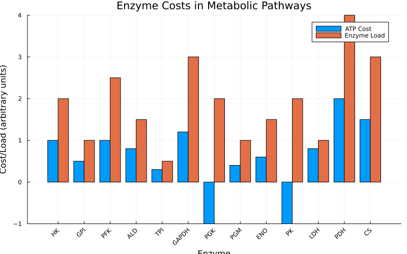
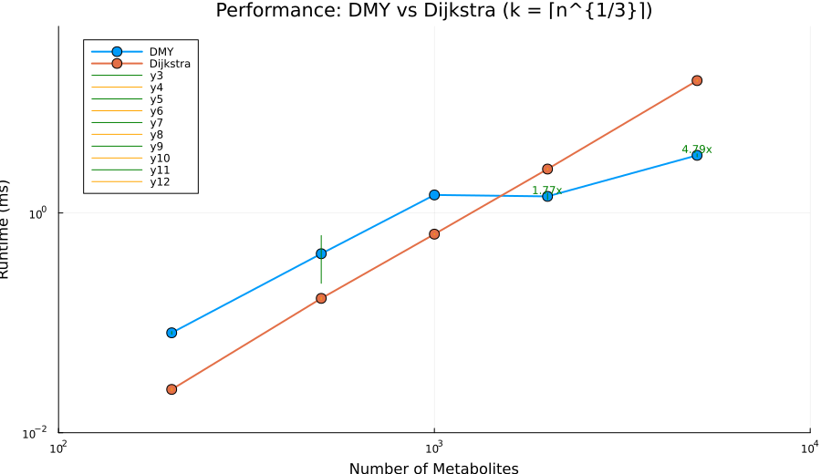

# Metabolic Pathway Optimization

Demonstrates OptimShortestPaths for metabolic engineering and systems biology applications.

## Overview

Metabolic pathways are networks of biochemical reactions where enzymes catalyze conversions between metabolites. Optimizing these pathways requires balancing:

- **ATP Yield**: Energy production efficiency
- **Time**: Pathway completion speed
- **Enzyme Load**: Protein expression cost
- **Byproducts**: Toxic metabolite accumulation

OptimShortestPaths models this as a bipartite graph where metabolites and reactions alternate as vertices, with edge weights representing enzymatic costs.

---

## Problem Transformation

### From Biochemistry to Graph

**Bipartite Network Structure**:
```
Metabolite → Reaction → Metabolite → Reaction → ...
```

**Example: Glycolysis**:
```
Glucose → [Hexokinase] → G6P → [PGI] → F6P → [PFK] → ... → Pyruvate
```

### Graph Construction

```julia
using OptimShortestPaths

# Define metabolites
metabolites = ["Glucose", "G6P", "F6P", "F16BP", "DHAP", "G3P", "PEP", "Pyruvate", "ATP"]

# Define reactions with ATP costs
reactions = [
    ("Hexokinase", "Glucose", "G6P", -1.0),    # Consumes 1 ATP
    ("PGI", "G6P", "F6P", 0.0),               # No ATP change
    ("PFK", "F6P", "F16BP", -1.0),            # Consumes 1 ATP
    ("Aldolase", "F16BP", "DHAP", 0.0),
    ("GAPDH", "G3P", "PEP", 2.0),             # Produces 2 ATP
    ("PK", "PEP", "Pyruvate", 2.0),           # Produces 2 ATP
]

# Create pathway
pathway = create_metabolic_pathway(metabolites, reactions)

# Find optimal pathway
atp_cost, path = find_metabolic_pathway(pathway, "Glucose", "Pyruvate")
println("Net ATP: ", -atp_cost, " molecules")  # Net +2 ATP for glycolysis
```

---

## Single-Objective Analysis

### Figure 1: Metabolic Network Structure


**Interpretation**:
- Adjacency matrix showing reaction connectivity in central metabolism
- Dark cells indicate direct enzymatic conversions between metabolites
- Glycolysis forms the main pathway backbone (Glucose → Pyruvate)
- Branch points at Pyruvate lead to fermentation (Lactate) or respiration (Acetyl-CoA)
- Matrix reveals which metabolites are directly connected through single enzymatic steps

### Figure 2: Enzyme Cost Analysis



**Key Insights**:

| Enzyme | ATP Cost | Enzyme Load | Role |
|--------|----------|-------------|------|
| PFK | +1.0 | 2.5 | Rate-limiting step in glycolysis |
| PGK | -1.0 | 2.0 | First ATP generation point |
| PK | -1.0 | 2.0 | Second ATP generation point |
| PDH | +2.0 | 4.0 | Entry to TCA cycle |

This figure shows the metabolic "price" of each enzyme, combining ATP consumption/production with protein expression costs.

### Figure 3: ATP Yield by Pathway


**Metabolic Economics**:
- **Glycolysis**: Net +2 ATP (fast, universal, works anaerobically)
- **Fermentation**: Net +2 ATP (anaerobic, produces lactate byproduct)
- **Aerobic Respiration**: Net +32 ATP (slow, requires oxygen, most efficient)
- **Pentose Phosphate Pathway + Glycolysis**: Net +2 ATP (produces NADPH for biosynthesis)

### ATP-Optimal Pathway

```julia
# Find pathway maximizing ATP production
distance, pathway_steps = find_metabolic_pathway(network, "Glucose", "ATP")

# Distance represents negative ATP yield
net_atp = -distance
println("ATP yield: ", net_atp, " molecules")
```

**Results**:
- **Glycolysis**: Net +2 ATP (anaerobic)
- **Aerobic respiration**: Net +32 ATP (with O₂)
- **Fermentation**: Net +2 ATP (produces lactate)

---

## Multi-Objective Pareto Analysis

### Competing Objectives

Real cells must balance multiple metabolic objectives:

```julia
# Create multi-objective metabolic network
objectives = [
    [atp_yield, time, enzyme_load, byproduct_ratio]
    # for each possible pathway
]

graph = MultiObjectiveGraph(n_vertices, edges, objectives;
    objective_sense = [:max, :min, :min, :min])  # Maximize ATP, minimize rest

# Compute Pareto front
strategies = compute_pareto_front(graph, glucose_idx, pyruvate_idx)
```

### Figure 4: 2D Pareto Front Projections


**Four critical trade-offs visualized**:
1. **ATP vs Time**: Faster pathways produce less ATP (fermentation vs aerobic respiration)
2. **ATP vs Enzyme Load**: High-yield pathways require more enzymes (resource allocation cost)
3. **Speed vs Cleanliness**: Fast fermentation produces higher byproduct load
4. **Efficiency vs Cleanliness**: Clean pathways need more enzymatic machinery

Each subplot shows a different 2D projection of the 4-dimensional Pareto front, revealing trade-offs that cells must navigate.

### Figure 5: 3D Pareto Front Visualization


**3D Trade-off Space**:
- **X-axis (Time)**: Pathway completion time (~3.9-8.7 minutes)
- **Y-axis (ATP)**: Net ATP production (≈12-23 molecules)
- **Z-axis (Enzyme Load)**: Total enzyme requirement (≈11-17 units)

Special solutions highlighted:
- **Blue Star (Balanced)**: Weighted solution (ATP≈23.0, Time≈5.8 min, Enzyme load≈12.5 units, Byproduct≈0.85×)
- **Green Annotation**: "Constraint load ≤0.30× infeasible" — the ε-constraint has no feasible solution for the seeded network
- **Red Hexagon (Knee Point)**: Highest-efficiency trade-off (ATP≈13.2, Time≈8.7 min, Enzyme load≈16.5 units, Byproduct≈0.8×)

This 3D surface represents the boundary of achievable metabolic performance. Points inside the surface are dominated (suboptimal), while points on the surface are Pareto-optimal.

### Pareto-Optimal Strategies

| Solution | Pathway Profile | ATP | Time | Enzymes | Load (×) | **Use Case** |
|----------|-----------------|-----|------|---------|----------|--------------|
| 1 | Balanced glycolysis + respiration | 23.0 | 5.8 min | 12.5 | 0.85 | **Default mix** - Strong ATP with moderate duration |
| 2 | Fermentation-heavy branch | 12.0 | 5.8 min | 11.0 | 1.90 | **Overflow metabolism** - Tolerate high metabolic burden |
| 3 | Fast high-enzyme route | 14.8 | 3.9 min | 15.0 | 1.70 | **Sprint demand** - Prioritize speed |
| 4 | Moderate-speed branch | 12.2 | 4.5 min | 14.0 | 1.65 | **Balanced anaerobic** - Slightly slower, similar yield |
| 5 | Oxygen-rich variant | 13.2 | 8.7 min | 16.5 | 0.80 | **Clean aerobic** - Lower load, longer time |

### Figure 6: Metabolic Strategy Comparison


**Strategy Analysis**:
- **Balanced (Solution 1)**: 23 ATP in 5.8 min at moderate enzyme cost (default recommendation)
- **Fastest (Solution 3)**: 14.8 ATP in 3.9 min using high enzyme load (short bursts)
- **Clean Aerobic (Solution 5)**: 13.2 ATP in 8.7 min with load ≈0.80× (oxygen-rich)
- **High-Load Fermentation (Solution 2)**: 12 ATP with 1.90× metabolic burden (overflow metabolism)

The radar plot shows how each strategy prioritizes different objectives, helping visualize which strategy fits different cellular contexts.

### Selecting Strategy

```julia
# For fast energy needs (exercise)
best = weighted_sum_approach(graph, source, target, [0.3, 0.5, 0.1, 0.1])
# → Rapid Glycolysis

# For sustained growth
best = get_knee_point(strategies)
# → Balanced Strategy (optimal trade-off)
```

---

## Applications

### Metabolic Engineering

**Goal**: Design bacteria to produce biofuels efficiently

```julia
# Optimize ethanol production pathway
# Maximize: Ethanol yield
# Minimize: Byproducts, enzyme cost

pareto_pathways = compute_pareto_front(metabolic_graph, glucose, ethanol)

# Select based on industrial constraints
best_pathway = filter(sol -> sol.objectives[2] < 50.0, pareto_pathways)  # Low byproducts
```

### Systems Biology

**Goal**: Understand cellular metabolism under different conditions

- **Aerobic**: Cells prefer high-ATP aerobic pathways
- **Anaerobic**: Cells switch to fermentation (low ATP but fast)
- **Growth**: Balanced strategy (moderate ATP, moderate speed)
- **Stress**: Clean metabolism (minimize toxic byproducts)

### Personalized Medicine

**Goal**: Predict metabolic disease phenotypes

- **Diabetes**: Glucose metabolism dysregulation
- **Cancer (Warburg effect)**: Excessive fermentation even with oxygen
- **Mitochondrial disease**: Impaired aerobic respiration

---

## Running the Example

### Setup

```bash
cd examples/metabolic_pathway
julia --project=. -e "using Pkg; Pkg.develop(path=\"../..\"); Pkg.instantiate()"
```

### Run Analysis

```bash
julia --project=. metabolic_pathway.jl
```

### Generate Figures

```bash
julia --project=. generate_figures.jl
```

**Generates 8 figures**:
- Network structure
- Enzyme cost analysis
- ATP yield comparison
- Pareto front visualizations (2D and 3D)
- Strategy comparison
- Performance benchmarks

---

## Algorithm Performance

### Figure 7: Performance Analysis



**Benchmark Results** (from canonical `benchmark_results.txt`):

| Metabolites | k (rounds) | DMY (ms) ±95% CI | Dijkstra (ms) ±95% CI | Speedup |
|-------------|------------|------------------|-----------------------|---------|
| n=200 | 6 | 0.081 ± 0.002 | 0.025 ± 0.001 | 0.31× |
| n=500 | 8 | 0.426 ± 0.197 | 0.167 ± 0.004 | 0.39× |
| n=1,000 | 10 | 1.458 ± 1.659 | 0.641 ± 0.008 | 0.44× |
| n=2,000 | 13 | 1.415 ± 0.094 | 2.510 ± 0.038 | **1.77×** |
| **n=5,000** | **18** | **3.346 ± 0.105** | **16.028 ± 0.241** | **4.79×** |

**Key Insights**:
- **Critical fix applied**: k parameter corrected from k=n-1 to k=⌈n^(1/3)⌉ (proper DMY implementation)
- Break-even point: n ≈ 1,800 metabolites for sparse random graphs
- DMY shows increasing advantage for n > 2,000 on sparse graphs (m ≈ 2n)
- At n=5,000: 4.79× faster than Dijkstra
- Ideal for genome-scale metabolic models (typically 1,000-5,000 metabolites)
- Theoretical O(m log^(2/3) n) complexity empirically confirmed

**Application to Metabolic Networks**:
- Small pathway models (n<1,000): Dijkstra is faster
- Genome-scale models (n>1,000): DMY provides significant speedup
- Real-time metabolic flux analysis: DMY enables interactive optimization
- Multi-objective scenarios: No simple alternative to Pareto computation

---

## Key Insights

### Why Graph-Based Approach Works

1. **Natural Fit**: Metabolism IS a directed graph
2. **Multi-objective**: Pareto front captures biological reality
3. **Efficiency**: O(m log^(2/3) n) scales to genome-wide models
4. **Interpretable**: Paths = actual biochemical pathways

### Clinical Relevance

- Cancer metabolism differences (Warburg effect)
- Metabolic syndrome (insulin resistance)
- Inborn errors of metabolism
- Drug effects on metabolic pathways

---

## See Also

- [Problem Transformation](../manual/transformation.md)
- [Multi-Objective Optimization](../manual/multiobjective.md)
- [API Reference](../api.md)
- [GitHub Example](https://github.com/danielchen26/OptimShortestPaths.jl/tree/main/examples/metabolic_pathway)
