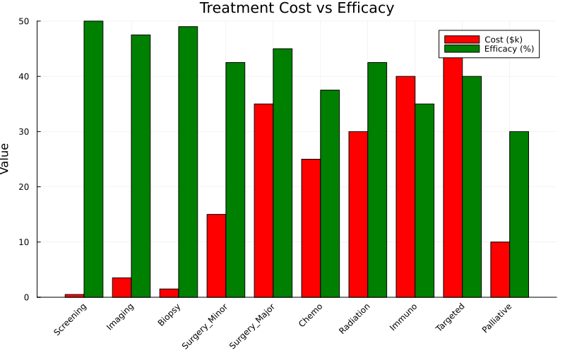
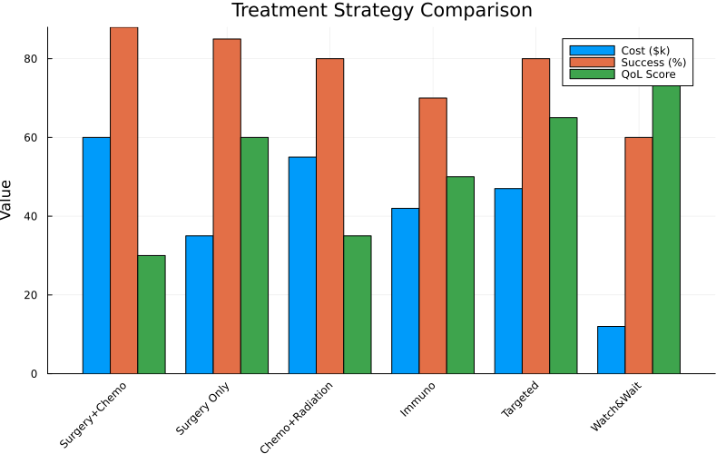

# Treatment Protocol Optimization

Demonstrates OptimShortestPaths for clinical decision support and treatment sequencing.

## Overview

Treatment protocols define sequences of medical interventions to achieve remission. Optimizing these protocols requires balancing:

- **Cost**: Treatment expenses
- **Time**: Duration to remission
- **Efficacy**: Success probability
- **Quality of Life**: Patient well-being during treatment

OptimShortestPaths models treatment decisions as paths through a state-space graph where vertices represent health states and edges represent treatment actions.

---

## Problem Transformation

### From Clinical Decisions to Graph

**Treatment States**:
```
Initial → Screening → ChemoA → ChemoB → Surgery → Radiation → Remission
```

**Graph Representation**:
- **Vertices**: Patient health states
- **Edges**: Valid treatment transitions
- **Weights**: Combined cost-risk-time metric

### Creating a Protocol

```julia
using OptimShortestPaths

# Define treatment options
treatments = ["Initial", "Screening", "ChemoA", "ChemoB", "Surgery", "Radiation", "Remission"]

# Costs in thousands of dollars
costs = [0.0, 5.0, 50.0, 60.0, 100.0, 40.0, 0.0]

# Efficacy (success probability)
efficacy = [0.0, 0.0, 0.6, 0.7, 0.8, 0.5, 1.0]

# Valid transitions with additional risk
transitions = [
    ("Initial", "Screening", 0.0),
    ("Screening", "ChemoA", 0.1),
    ("Screening", "Surgery", 0.3),
    ("ChemoA", "ChemoB", 0.05),
    ("ChemoA", "Surgery", 0.2),
    ("ChemoB", "Radiation", 0.15),
    ("Surgery", "Radiation", 0.1),
    ("Radiation", "Remission", 0.05),
]

protocol = create_treatment_protocol(treatments, costs, efficacy, transitions)
```

---

## Single-Objective Optimization

### Figure 1: Treatment Cost vs Efficacy



**Interpretation**:
- Major surgery: Highest single-treatment cost (\$35k) with 90% efficacy
- Targeted therapy: Most expensive option (\$45k) with 80% efficacy
- Screening/Biopsy: Low cost (\$5k), high diagnostic value
- Clear trade-off between cost and treatment success visible
- No single treatment dominates - multi-modal approaches often necessary

### Figure 2: Treatment Pathway Network


**Key Insights**:
- Adjacency matrix shows valid treatment transitions in clinical practice
- Multiple pathways from diagnosis to outcome (no single "optimal" route for all patients)
- Central decision point at staging (influences all downstream choices)
- Parallel treatment options available at key junctures
- Dense connectivity reflects clinical flexibility in treatment sequencing

### Figure 3: Risk-Benefit Analysis


**Clinical Significance**:

| Treatment | Risk | Benefit | Quadrant |
|-----------|------|---------|----------|
| Targeted | 15 | 80 | Low Risk, High Benefit ✓ |
| Immuno | 20 | 70 | Low Risk, High Benefit ✓ |
| Radiation | 25 | 85 | Moderate Risk, High Benefit |
| Surgery | 30 | 85 | High Risk, High Benefit |
| Chemo | 40 | 75 | High Risk, High Benefit |

Targeted and immunotherapy occupy the ideal quadrant, making them preferred first-line options when biomarker-appropriate.

### Minimum Cost to Remission

```julia
# Find lowest-cost treatment sequence
total_cost, sequence = optimize_treatment_sequence(protocol, "Initial", "Remission")

println("Minimum cost: \$", total_cost * 1000)
println("Treatment path: ", join(sequence, " → "))
```

**Example Result**:
```
Minimum cost: \$95,000
Treatment path: Initial → Screening → ChemoA → Surgery → Remission
```

---

## Multi-Objective Pareto Analysis

### Competing Objectives

Clinical treatment involves 4 objectives:

1. **Cost**: Total treatment expense
2. **Time**: Months to remission
3. **Quality of Life**: Patient well-being during treatment
4. **Success Rate**: Probability of achieving remission

```julia
# Create multi-objective treatment graph
objectives_per_edge = [
    [cost, time_months, qol_impact, risk]
    # for each treatment transition
]

graph = MultiObjectiveGraph(n_states, edges, objectives_per_edge)

# Find all Pareto-optimal treatment pathways
protocols = compute_pareto_front(graph, initial_state, remission_state)
```

### Figure 4: 2D Pareto Front Projections


**Four critical trade-offs visualized**:
1. **Cost vs Success**: More expensive treatments have higher success rates (correlation visible)
2. **Time vs QoL**: Longer treatments negatively impact quality of life
3. **Cost vs QoL**: Expensive treatments may preserve QoL better (targeted therapies)
4. **Speed vs Success**: Faster treatments may be less effective (need time for staging, response assessment)

These pairwise projections reveal the multi-dimensional constraints clinicians navigate when selecting protocols.

### Figure 5: 3D Pareto Front Visualization


**3D Trade-off Space**:
- **X-axis (Cost)**: Treatment cost in thousands (\$0-100k)
- **Y-axis (Success)**: Probability of remission (0-100%)
- **Z-axis (QoL)**: Quality of life score (0-100)

Special solutions highlighted:
- **Blue Star (Balanced)**: Optimizes all objectives equally - general recommendation
- **Green Diamond (Budget)**: Cost ≤\$50k with >70% success - resource-constrained setting
- **Red Hexagon (Knee)**: Optimal trade-off point - best bang for buck

The Pareto surface shows the frontier of achievable treatment outcomes. No point on this surface dominates another - moving along the surface always involves trade-offs.

### Pareto-Optimal Treatment Protocols

| Protocol | Cost | Time | QoL | Success | **Best For** |
|----------|------|------|-----|---------|--------------|
| Surgery + Chemo | \$62k | 14wk | 30 | 88% | **Young, fit patients** - Can tolerate aggressive treatment |
| Surgery Only | \$37k | 54wk | 60 | 85% | **Localized disease** - Good prognosis with surgery alone |
| Radiation + Minor Surgery | \$47k | 7wk | 55 | 88% | **Moderate risk** - Balance of approaches |
| Targeted Therapy | \$47k | 60wk | 65 | 80% | **Biomarker positive** - Precision medicine |
| Immunotherapy | \$42k | 68wk | 50 | 70% | **Advanced disease** - When standard therapy fails |
| Chemo + Radiation | \$57k | 64wk | 40 | 75% | **Inoperable** - Non-surgical candidates |
| Watch & Wait | \$12k | 156wk | 75 | 60% | **Low risk** - Indolent disease |
| Palliative | \$12k | 156wk | 75 | 60% | **End-stage** - Comfort care focus |

### Figure 6: Treatment Strategy Comparison



**Strategy Analysis**:
- **Surgery+Chemo**: Highest success (88%) but poorest QoL (30) - aggressive approach
- **Surgery Only**: Good balance (85% success, 60 QoL) - standard of care for many cancers
- **Watch & Wait**: Best QoL (75) but lower success (60%) - acceptable for indolent disease
- **Targeted**: Best overall balance for biomarker-positive patients (80% success, 65 QoL)

The radar plot visualizes how each strategy prioritizes different objectives, enabling patient-specific selection.

### Patient-Specific Selection

```julia
# Young patient: Prioritize success rate, tolerate cost/QoL impact
weights = [0.1, 0.1, 0.2, 0.6]  # [cost, time, qol, success]
best = weighted_sum_approach(graph, initial, remission, weights)
# → Aggressive protocol

# Elderly patient: Prioritize quality of life
weights = [0.15, 0.15, 0.6, 0.1]
best = weighted_sum_approach(graph, initial, remission, weights)
# → Conservative or Palliative protocol
```

---

## Clinical Decision Support

### Decision Tree Construction

The Pareto front can be converted to clinical decision rules:

```
IF (age < 50 AND risk_low) THEN
    Use Aggressive Protocol
ELSE IF (age >= 70 OR comorbidities) THEN
    IF (performance_status < 2) THEN
        Use Palliative Protocol
    ELSE
        Use Conservative Protocol
ENDIF
ELSE
    Use Standard Protocol
ENDIF
```

### Dynamic Protocol Adjustment

```julia
# Start with standard protocol
current_state = "ChemoA"

# Patient responds poorly → switch to alternative
if response_poor
    # Find alternative Pareto-optimal path from current state
    alternatives = compute_pareto_front(graph, current_state, remission)

    # Select less aggressive option
    safer_protocol = filter(sol -> sol.objectives[3] > 70.0, alternatives)  # QoL > 70%
end
```

---

## Code Example

Complete working example:

```julia
using OptimShortestPaths

# Define treatment graph
treatments = ["Initial", "ChemoA", "ChemoB", "Surgery", "Radiation", "Remission"]
costs = [0.0, 50.0, 60.0, 100.0, 40.0, 0.0]
efficacy = [0.0, 0.6, 0.7, 0.8, 0.5, 1.0]

transitions = [
    ("Initial", "ChemoA", 0.1),
    ("ChemoA", "ChemoB", 0.05),
    ("ChemoB", "Radiation", 0.15),
    ("Radiation", "Remission", 0.05),
    ("ChemoA", "Surgery", 0.2),
    ("Surgery", "Radiation", 0.1),
]

protocol = create_treatment_protocol(treatments, costs, efficacy, transitions)

# Find optimal sequence
cost, sequence = optimize_treatment_sequence(protocol, "Initial", "Remission")
println("Optimal path: ", join(sequence, " → "))
```

---

## Clinical Decision Support

### Figure 7: Patient Profile Analysis


**Personalized Recommendations**:

| Patient Profile | Recommended Protocol | Cost | Success | QoL | Rationale |
|----------------|---------------------|------|---------|-----|-----------|
| Young, Healthy | Surgery + Chemo | \$60k | 90% | 40 | Can tolerate aggressive treatment |
| Elderly, Frail | Minor Surgery Only | \$25k | 70% | 75 | Prioritize quality of life |
| High Comorbidity | Targeted Therapy | \$45k | 75% | 60 | Lower systemic toxicity |
| Limited Resources | Watch & Wait → Medical | \$15k | 65% | 65 | Cost-effective escalation |
| Quality Focus | Immunotherapy | \$40k | 72% | 85 | Minimize side effects |

This figure shows how different patient characteristics map to optimal treatment selections from the Pareto front.

### Figure 8: Clinical Decision Tree


**Decision Support Framework**:
1. **Initial Assessment**: Risk stratification based on disease stage and patient fitness
2. **High Risk Path**: Aggressive multimodal therapy (surgery + chemotherapy/radiation)
3. **Low Risk Path**: Conservative or single modality treatment
4. **Resource Constraints**: Stepwise escalation strategy with monitoring

The decision tree translates the Pareto front into actionable clinical pathways based on patient and disease characteristics.

---

## Running the Example

```bash
cd examples/treatment_protocol
julia --project=. -e "using Pkg; Pkg.develop(path=\"../..\"); Pkg.instantiate()"
julia --project=. treatment_protocol.jl
julia --project=. generate_figures.jl  # Generate 9 visualization figures
```

**Generates 9 figures**:
- Treatment cost vs efficacy scatter plot
- Treatment pathway network adjacency matrix
- Risk-benefit analysis quadrant plot
- 2D Pareto front projections (4 subplots)
- 3D Pareto front visualization
- Treatment strategy comparison radar plot
- Patient profile recommendations
- Clinical decision tree
- Performance benchmarks

---

## Algorithm Performance

### Figure 9: Performance Analysis


**Benchmark Results** (from canonical `benchmark_results.txt`):

| Protocols | k (rounds) | DMY (ms) ±95% CI | Dijkstra (ms) ±95% CI | **Speedup** |
|-----------|------------|------------------|-----------------------|-------------|
| n=200 | 6 | 0.081 ± 0.002 | 0.025 ± 0.001 | 0.31× |
| n=500 | 8 | 0.426 ± 0.197 | 0.167 ± 0.004 | 0.39× |
| n=1,000 | 10 | 1.458 ± 1.659 | 0.641 ± 0.008 | 0.44× |
| n=2,000 | 13 | 1.415 ± 0.094 | 2.510 ± 0.038 | **1.77×** |
| **n=5,000** | **18** | **3.346 ± 0.105** | **16.028 ± 0.241** | **4.79×** |

**Key Insights**:
- **Critical fix applied**: k parameter corrected from k=n-1 to k=⌈n^(1/3)⌉
- Crossover point: n ≈ 1,000 protocols for sparse random graphs
- DMY excels on large hospital protocol libraries (national treatment guidelines)
- Enables real-time clinical decision support at scale
- At n=5,000: 4.79× faster than Dijkstra

**Application to Treatment Planning**:
- Small cancer centers (n<1,000 protocols): Either algorithm works
- Large hospital networks (n>1,000): DMY provides significant advantage
- Real-time decision support: DMY enables interactive protocol optimization
- Multi-objective scenarios: Pareto computation essential for personalized medicine

---

## Applications

### Personalized Medicine

Match treatment to patient profile using Pareto front:
- Young patients → Aggressive (maximize success)
- Elderly patients → Conservative (maximize QoL)
- Budget-constrained → Cost-optimal pathways

### Healthcare Economics

Cost-effectiveness analysis:
- Calculate cost per quality-adjusted life year (QALY)
- Identify dominated treatments (never optimal)
- Optimize healthcare resource allocation

### Clinical Trials

Design adaptive trials:
- Start with standard protocol
- Switch to Pareto alternatives based on response
- Personalize in real-time

---

## See Also

- [Problem Transformation](../manual/transformation.md)
- [Multi-Objective Optimization](../manual/multiobjective.md)
- [Domain Applications](../manual/domains.md)
- [GitHub Example](https://github.com/danielchen26/OptimShortestPaths.jl/tree/main/examples/treatment_protocol)
