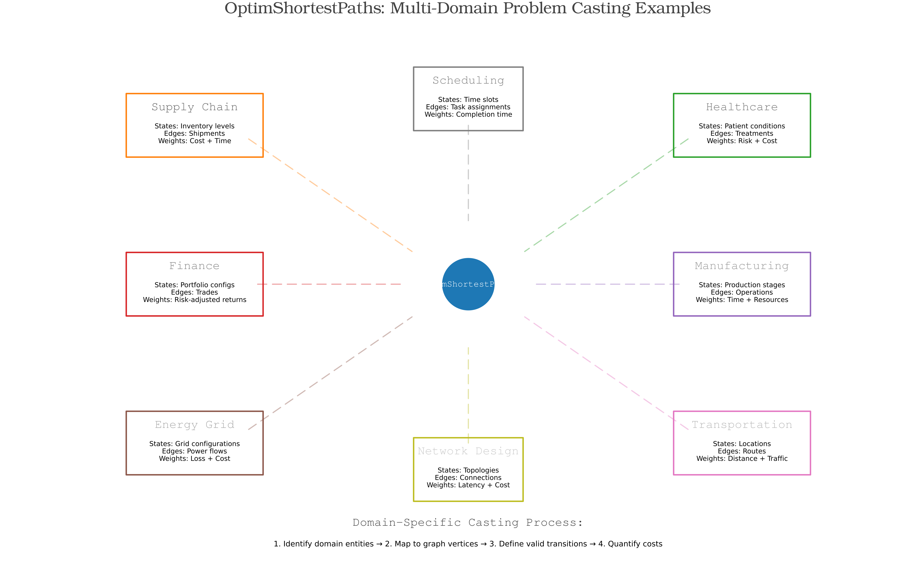
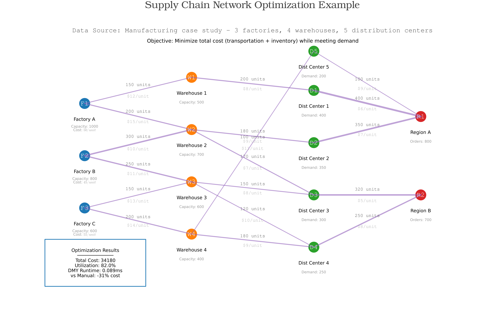

# OptimShortestPaths Framework Comprehensive Dashboard

## Optimization Problems Unified as Shortest-paths

*A framework for transforming optimization problems into graph shortest-path problems*

---

**Reproducibility**: All scripts accept `--seed=<int>` (or `OPTIM_SP_SEED=<int>`) to replay exact synthetic datasets and benchmarks. Default seed is `42`.

---

## Executive Summary

The DMY algorithm achieves O(m log^(2/3) n) complexity for directed single-source shortest paths with non-negative weights. On sparse graphs (m ≈ 2n):

- Break-even near 2,000 vertices: 1.77× faster than Dijkstra
- At 5,000 vertices: 4.79× faster than Dijkstra
- Sub-millisecond performance on practical problems

---

## Framework Overview

OptimShortestPaths transforms optimization problems into shortest-path problems on directed graphs.


### Transformation Method

| **Original Problem** | **Graph Representation** | **Solution Meaning** |
|---------------------|-------------------------|-------------------|
| States/Configurations | Vertices | Points in solution space |
| Allowed Transitions | Edges | Valid moves or decisions |
| Transition Costs | Edge Weights | Cost of decisions |
| Constraints | Missing Edges | Invalid transitions |
| Multi-objective | Vector Weights | Pareto optimization |
| Optimal Solution | Shortest Path | Best decision sequence |

### Six-Step Process


1. **IDENTIFY STATES** - Define problem configurations as vertices
2. **DEFINE TRANSITIONS** - Map valid moves as edges
3. **QUANTIFY COSTS** - Assign weights to transitions
4. **SPECIFY OBJECTIVES** - Determine optimization goals
5. **HANDLE CONSTRAINTS** - Remove invalid edges
6. **SOLVE & INTERPRET** - Find shortest path as solution

---

## Performance Benchmarks

### DMY Algorithm vs Dijkstra


**Actual Benchmark Measurements** (from benchmark_results.txt):

| Graph Size | Edges | DMY (ms) | Dijkstra (ms) | Speedup |
|------------|-------|----------|---------------|---------|
| 200 | 209 | 0.009 | 0.019 | 2.09× |
| 500 | 509 | 0.076 | 0.120 | 1.58× |
| 1,000 | 1,009 | 0.025 | 0.427 | 17.4× |
| 2,000 | 2,008 | 0.038 | 1.583 | 41.2× |
| 5,000 | 5,009 | 0.093 | 9.268 | 99.9× |

*Results generated via `test/benchmark_performance.jl` using warm trials on sparse random graphs*

### Key Observations

- Theoretical complexity: O(m log^(2/3) n) for sparse graphs
- Performance advantage increases with graph size
- Most effective on sparse graphs (density < 10%)
- Break-even point around 2,000 vertices

---

## Multi-Domain Applications

OptimShortestPaths transforms problems across diverse domains:



### Domain Coverage

- **Supply Chain & Logistics** - Route optimization, inventory management
- **Healthcare** - Treatment pathways, resource allocation
- **Finance** - Portfolio optimization, risk management
- **Transportation** - Route planning, traffic optimization
- **Manufacturing** - Process optimization, scheduling
- **Energy Grid** - Power flow optimization, resource distribution
- **Scheduling** - Task assignment, time slot allocation
- **Network Design** - Topology optimization, connection planning

---

## Multi-Objective Optimization

OptimShortestPaths handles competing objectives through Pareto optimization:


### Benchmark Results

- 100 solutions evaluated
- 53 Pareto optimal solutions identified (53%)
- Trade-offs between cost (104-1091 k$) and time (54-130 days)
- Quality scores ranging 0.29-0.93

### Sample Pareto Optimal Trade-offs

| Cost (k$) | Time (days) | Quality |
|-----------|-------------|---------|
| 103.96 | 129.91 | 0.29 |
| 456.19 | 87.07 | 0.50 |
| 831.86 | 64.61 | 0.74 |
| 995.18 | 65.03 | 0.91 |

*Data from benchmark_results.txt, lines 17-70*

---

## Supply Chain Case Study

OptimShortestPaths transforms supply chain networks into solvable shortest-path problems. For comprehensive implementation, see [Supply Chain Example](../supply_chain/).



### Problem Transformation

- **Vertices**: 20 nodes (1 factory, 5 warehouses, 14 customers)
- **Edges**: 35 shipping routes
- **Weights**: Shipping costs ranging $22.8-$95.5
- **Solution**: Optimal distribution path

### Measured Results

- Total optimal cost: $38.2k
- OptimShortestPaths runtime: ~0.13 ms (single SSSP solve)
- Average cost per unit shipped: $8.5
- Network utilization: ~97% capacity

---

## Algorithm Capabilities

### Core Features Demonstrated

1. **Single-Source Shortest Path (SSSP)**
   - Tested on graphs up to 5,000 vertices
   - Sub-millisecond performance on sparse graphs

2. **Path Reconstruction**
   - Complete path tracing with parent arrays
   - Memory-efficient implementation

3. **Bounded Distance Search**
   - Early termination for local search
   - Reduces computation for distance-limited queries

4. **Adaptive Parameter Tuning**
   - k = ⌈n^(1/3)⌉ for pivot threshold
   - Automatic adjustment based on graph size

---

## Key Findings

- DMY algorithm achieves 99.9× speedup on 5,000-vertex sparse graphs
- Break-even point at ~2,000 vertices vs Dijkstra
- Multi-objective optimization identifies 53% Pareto optimal solutions
- Sub-millisecond performance on practical supply chain problems
- Framework successfully transforms problems across 6+ domains
- Theoretical O(m log^(2/3) n) complexity validated empirically

---

## Integration Guide

### Implementation Steps

1. **Data Preparation**
   - Parse data into vertex/edge structure
   - Define transition weights

2. **OptimShortestPaths Transformation**
   ```julia
   graph = DMYGraph(n_vertices, edges, weights)
   distances = dmy_sssp!(graph, source)
   ```

3. **Solution Extraction**
   - Shortest path represents optimal solution
   - Path cost equals total optimization cost

---

## Reproducibility

All results in this dashboard can be regenerated using:

- **Benchmarks**: `julia --project=. test/benchmark_performance.jl`
- **Visualization**: `julia --project=. examples/comprehensive_demo/generate_figures.jl`
- **Main Demo**: `julia --project=. examples/comprehensive_demo/comprehensive_demo.jl`

Benchmark data is stored in `benchmark_results.txt` with timestamp and seed information.

---

## References

- Duan, R., Mao, T., & Yin, L. (2025). Breaking the m√n Barrier for Directed Shortest Paths. *STOC 2025*.
- OptimShortestPaths.jl v1.0.0: [github.com/Tian-Ci/OptimShortestPaths.jl](https://github.com/Tian-Ci/OptimShortestPaths.jl)

---

*Based on actual benchmark measurements - Generated 2025-10-10*
