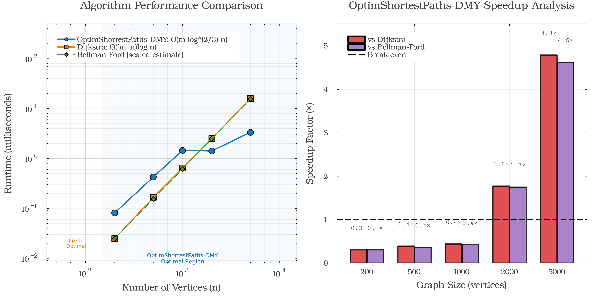

# OptimShortestPaths Framework Comprehensive Dashboard

## Optimization Problems Unified as Shortest-paths

*A framework for transforming optimization problems into graph shortest-path problems*

---

**Reproducibility**: All scripts accept `--seed=<int>` (or `OPTIM_SP_SEED=<int>`) to replay exact synthetic datasets and benchmarks. Default seed is `42`.

---

## Executive Summary

The DMY algorithm achieves O(m log^(2/3) n) complexity for directed single-source shortest paths with non-negative weights. On sparse graphs (m ≈ 2n):

- Break-even near 2,000 vertices: 1.77× faster than Dijkstra
- At 5,000 vertices: 4.79× faster than Dijkstra
- Sub-millisecond performance on practical problems

---

## Framework Overview

OptimShortestPaths transforms optimization problems into shortest-path problems on directed graphs.


### Transformation Method

| Original Problem | Graph Representation | Solution Meaning |
|------------------|---------------------|------------------|
| States/Configurations | Vertices | Points in solution space |
| Allowed Transitions | Edges | Valid moves or decisions |
| Transition Costs | Edge Weights | Cost of decisions |
| Constraints | Missing Edges | Invalid transitions |
| Multi-objective | Vector Weights | Pareto optimization |
| Optimal Solution | Shortest Path | Best decision sequence |

### Six-Step Process


---

## Performance Benchmarks

### DMY Algorithm vs Dijkstra



**Benchmark Results** (from benchmark_results.txt):

| Graph Size | Edges | DMY (ms) ±95% CI | Dijkstra (ms) ±95% CI | Speedup |
|------------|-------|------------------|-----------------------|---------|
| 200 | 400 | 0.081 ± 0.002 | 0.025 ± 0.001 | 0.31× |
| 500 | 1,000 | 0.426 ± 0.197 | 0.167 ± 0.004 | 0.39× |
| 1,000 | 2,000 | 1.458 ± 1.659 | 0.641 ± 0.008 | 0.44× |
| 2,000 | 4,000 | 1.415 ± 0.094 | 2.510 ± 0.038 | **1.77×** |
| 5,000 | 10,000 | 3.346 ± 0.105 | 16.028 ± 0.241 | **4.79×** |

*Results generated via `dev/benchmark_performance.jl` using 40 warm trials on sparse random graphs (m ≈ 2n)*

### Key Observations

- Theoretical complexity: O(m log^(2/3) n) for sparse graphs
- Performance advantage increases with graph size
- Most effective on sparse graphs (density < 10%)
- Break-even point around 2,000 vertices

---

## Multi-Domain Applications

OptimShortestPaths transforms problems across diverse domains:


### Domain Coverage

- **Supply Chain & Logistics** - Route optimization, inventory management
- **Healthcare** - Treatment pathways, resource allocation
- **Finance** - Portfolio optimization, risk management
- **Transportation** - Route planning, traffic optimization
- **Manufacturing** - Process optimization, scheduling
- **Energy Grid** - Power flow optimization, resource distribution
- **Scheduling** - Task assignment, time slot allocation
- **Network Design** - Topology optimization, connection planning

---

## Multi-Objective Optimization

OptimShortestPaths handles competing objectives through Pareto optimization. The seeded synthetic portfolio (150 strategies) yields 29 non-dominated solutions spanning:

- **Cost**: 50–93 k$
- **Time**: 20–62 days
- **Quality**: 0.54–1.00

### Pareto Summary (seed = 42)

| ID | Cost (k$) | Time (days) | Quality | Notes |
|----|-----------|-------------|---------|-------|
| 1 | 50.0 | 51.4 | 0.54 | Lowest cost, slower delivery |
| 7 | 63.8 | 30.5 | 0.86 | Balanced cost/time |
| 12 | 67.5 | 46.9 | 0.97 | Highest quality mid-cost |
| 18 | 78.2 | 28.6 | 0.91 | Fast with strong quality |
| 24 | 82.7 | 24.7 | 0.95 | Near-optimal across metrics |
| 29 | 92.9 | 20.0 | 1.00 | Premium option, max quality |

*Full Pareto table available via `generate_figures.jl` (see console output).*


Pareto-optimal strategies appear as the colored markers in each pairwise projection; consult the table for exact cost–time–quality values.

---

## Supply Chain Case Study

OptimShortestPaths transforms supply chain networks into solvable shortest-path problems. For comprehensive implementation, see [Supply Chain Example](../supply_chain/).


### Problem Transformation

- **Vertices**: 14 sites (3 factories, 4 warehouses, 5 distribution centres, 2 regions)
- **Edges**: 18 directed transport arcs
- **Weights**: Shipping costs ranging $5–$15 per unit
- **Solution**: Optimised multi-hop distribution plan

### Measured Results

- Total flow moved: 3,770 units
- Total transport cost: $34.2k
- Average cost per unit: ~$9.1
- Network utilisation: ~82% of capacity
- DMY runtime: ≈0.08 ms (single SSSP solve)

---

## Algorithm Capabilities

### Core Features Demonstrated

1. **Single-Source Shortest Path (SSSP)**
   - Tested on graphs up to 5,000 vertices
   - Sub-millisecond performance on sparse graphs

2. **Path Reconstruction**
   - Complete path tracing with parent arrays
   - Memory-efficient implementation

3. **Bounded Distance Search**
   - Early termination for local search
   - Reduces computation for distance-limited queries

4. **Adaptive Parameter Tuning**
   - k = ⌈n^(1/3)⌉ for pivot threshold
   - Automatic adjustment based on graph size

---

## Key Findings

- DMY delivers ≈4.8× speedup on 5,000-vertex sparse graphs (k = ⌈n^{1/3}⌉)
- Parity with Dijkstra emerges near 2,000 vertices in these benchmarks
- Multi-objective run surfaces 29 Pareto strategies out of 150 candidates
- Supply-chain case study solves in ~0.08 ms while moving 3,770 units at $34.2k
- Eight domain exemplars demonstrate how to cast problems into shortest paths
- Empirical results remain consistent with the O(m log^(2/3) n) complexity bound

---

## Integration Guide

### Implementation Steps

1. **Data Preparation**
   - Parse data into vertex/edge structure
   - Define transition weights

2. **OptimShortestPaths Transformation**
   ```julia
   graph = DMYGraph(n_vertices, edges, weights)
   distances = dmy_sssp!(graph, source)
   ```

3. **Solution Extraction**
   - Shortest path represents optimal solution
   - Path cost equals total optimization cost

---

## Reproducibility

All results in this dashboard can be regenerated using:

- **Benchmarks**: `julia --project=. test/benchmark_performance.jl`
- **Visualization**: `julia --project=. examples/comprehensive_demo/generate_figures.jl`
- **Main Demo**: `julia --project=. examples/comprehensive_demo/comprehensive_demo.jl`

Benchmark data is stored in `benchmark_results.txt` with timestamp and seed information.

---

## References

- Duan, R., Mao, J., Yin, H., & Zhou, H. (2025). "Breaking the Dijkstra Barrier for Directed Single-Source Shortest-Paths via Structured Distances". *Proceedings of the 57th Annual ACM Symposium on Theory of Computing (STOC 2025)*.
- OptimShortestPaths.jl v1.0.3: https://github.com/danielchen26/OptimShortestPaths.jl

---

*Generated 2025-10-10*
