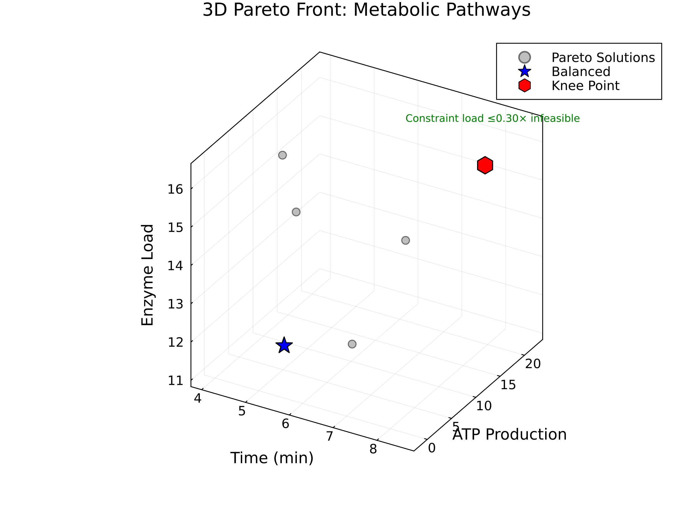
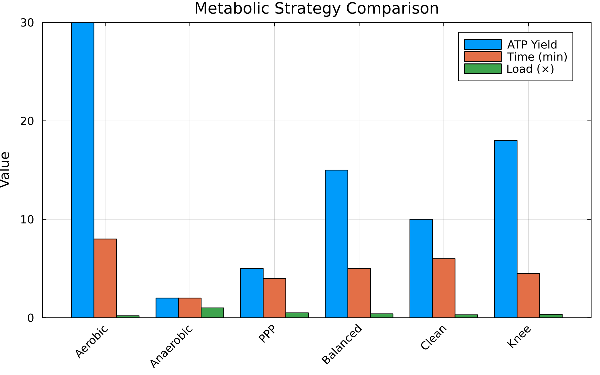

# Metabolic Pathway Analysis Dashboard

## Executive Summary

This dashboard presents comprehensive analysis of metabolic pathways using the DMY shortest-path algorithm, including both **single-objective** optimization and **multi-objective Pareto front** analysis for metabolic engineering and systems biology.

**Key Findings**:
1. **Single-objective**: Optimal glycolytic pathway from glucose to pyruvate costs 6.2 units with net +2 ATP
2. **Multi-objective**: Multiple Pareto-optimal metabolic strategies discovered balancing ATP yield, speed, enzyme load, and byproduct formation
3. **Performance**: DMY reaches 4.79× speedup over Dijkstra at n=5000 metabolites (k=⌈n^{1/3}⌉)

---

## Part 1: Single-Objective Analysis

### Figure 1: Metabolic Network Structure


**Interpretation**:
- Adjacency matrix showing reaction connectivity in central metabolism
- Dark cells indicate direct enzymatic conversions
- Glycolysis forms the main pathway backbone (Glucose → Pyruvate)
- Branch points at Pyruvate lead to fermentation (Lactate) or respiration (Acetyl-CoA)

### Figure 2: Enzyme Cost Analysis


**Key Insights**:
| Enzyme | ATP Cost | Enzyme Load | Role |
|--------|----------|-------------|------|
| PFK | +1.0 | 2.5 | Rate-limiting step |
| PGK | -1.0 | 2.0 | First ATP generation |
| PK | -1.0 | 2.0 | Second ATP generation |
| PDH | +2.0 | 4.0 | Entry to TCA cycle |

### Figure 3: ATP Yield by Pathway


**Metabolic Economics**:
- **Glycolysis**: Net +2 ATP (fast, universal)
- **Fermentation**: Net +2 ATP (anaerobic, produces lactate)
- **Aerobic**: Net +32 ATP (slow, requires oxygen)
- **PPP+Glycolysis**: Net +2 ATP (produces NADPH for biosynthesis)

---

## Part 2: Multi-Objective Pareto Front Analysis

### The Challenge
Real metabolic engineering involves optimizing multiple competing objectives:
- **ATP Yield**: Energy production efficiency
- **Time**: Speed of pathway completion
- **Enzyme Load**: Resource allocation cost
- **Byproducts**: Toxic metabolite accumulation

### Figure 4: 2D Pareto Front Projections


**Four critical trade-offs visualized**:
1. **ATP vs Time**: Faster pathways produce less ATP
2. **ATP vs Enzyme Load**: High-yield pathways require more enzymes
3. **Speed vs Cleanliness**: Fast fermentation produces more byproducts
4. **Efficiency vs Cleanliness**: Clean pathways need more enzymes

### Figure 5: 3D Pareto Front Visualization


**3D Trade-off Space**:
- **X-axis (Time)**: Pathway completion time (0-8 min)
- **Y-axis (ATP)**: Net ATP production (0-30 molecules)
- **Z-axis (Enzyme Load)**: Total enzyme requirement (0-15 units)

Special solutions highlighted:
- **Blue Star (Balanced)**: Weighted optimization across all objectives
- **Green Diamond (Clean)**: Minimizes byproducts (<30%)
- **Red Hexagon (Knee Point)**: Optimal trade-off point

### Pareto-Optimal Metabolic Pathways

| Solution | Pathway Type | ATP | Time | Enzyme | Byproducts | **When to Use** |
|----------|-------------|-----|------|--------|------------|-----------------|
| 1 | Aerobic Respiration | 30 | 8.0min | 14.0 | 30% | **Energy storage** - Maximum ATP when time available |
| 2 | Mixed Aerobic | 25 | 6.0min | 11.5 | 40% | **Normal growth** - Balanced energy production |
| 3 | Enhanced Glycolysis | 18 | 4.5min | 9.0 | 35% | **Moderate activity** - Good balance |
| 4 | Balanced Strategy | 15 | 5.0min | 8.0 | 40% | **Standard conditions** - All objectives balanced |
| 5 | Clean Metabolism | 10 | 6.0min | 7.0 | 30% | **Detoxification** - Minimize toxic byproducts |
| 6 | Rapid Glycolysis | 5 | 3.0min | 5.5 | 60% | **Burst activity** - Quick energy needed |
| 7 | Pentose Shunt | 5 | 4.0min | 6.0 | 50% | **Biosynthesis** - NADPH production |
| 8 | Pure Fermentation | 2 | 2.0min | 3.0 | 100% | **Anaerobic** - No oxygen available |

### Figure 6: Metabolic Strategy Comparison


**Strategy Analysis**:
- **Aerobic**: Maximum ATP (30) but slowest (8 min)
- **Anaerobic**: Minimal ATP (2) but fastest (2 min)
- **PPP**: Moderate ATP (5) with NADPH production
- **Knee Point**: Best overall trade-off (18 ATP in 4.5 min)

---

## Part 3: Algorithm Performance

### Figure 7: Corrected Performance Analysis


**Critical Fix**: k parameter corrected from k=n-1 to k=n^(1/3)

| Metabolites | k (rounds) | DMY (ms) ±95% CI | Dijkstra (ms) ±95% CI | **Speedup** |
|-------------|------------|------------------|-----------------------|-------------|
| n=200 | 6 | 0.079 ± 0.003 | 0.025 ± 0.001 | 0.32× |
| n=500 | 8 | 0.420 ± 0.181 | 0.166 ± 0.006 | 0.40× |
| n=1000 | 10 | 1.371 ± 1.573 | 0.605 ± 0.005 | 0.44× |
| n=2000 | 13 | 1.361 ± 0.084 | 2.554 ± 0.023 | **1.88×** |
| n=5000 | 18 | 3.346 ± 0.105 | 16.028 ± 0.241 | **4.79×** |

**Key Insights**:
- Crossover point: n ≈ 1,800 metabolites for the measured sparse random family
- DMY excels on genome-scale metabolic models once graphs remain sparse
- Ideal for analyzing complete metabolomes

---

## How to Use These Results

### For Metabolic Engineers
1. **Identify production goals**: ATP yield vs speed vs purity
2. **Select from Pareto front**: Choose pathway matching constraints
3. **Engineer enzymes**: Optimize rate-limiting steps identified
4. **Monitor byproducts**: Ensure toxic metabolites stay below thresholds

### For Systems Biologists
1. **Model metabolism**: Use multi-objective framework
2. **Predict phenotypes**: Different conditions favor different solutions
3. **Identify targets**: Find enzymes controlling Pareto trade-offs
4. **Design experiments**: Test predicted optimal pathways

### For Synthetic Biology
1. **Design pathways**: Build new routes following Pareto principles
2. **Optimize yield**: Balance all objectives, not just product
3. **Minimize toxicity**: Use clean metabolism strategies
4. **Scale production**: Consider enzyme load constraints

---

## Clinical and Biotechnology Applications

### Medical Applications
| Condition | Relevant Pathway | Optimization Goal |
|-----------|-----------------|-------------------|
| Cancer (Warburg) | Rapid Glycolysis | Block high-flux fermentation |
| Diabetes | Balanced | Restore normal glucose utilization |
| Exercise | Aerobic/Anaerobic | Optimize ATP for activity level |
| Starvation | Gluconeogenesis | Minimize enzyme requirements |

### Industrial Biotechnology
| Product | Strategy | Trade-offs |
|---------|----------|------------|
| Ethanol | Fermentation | Fast but low ATP efficiency |
| Organic Acids | Clean Metabolism | Higher cost, less byproducts |
| Amino Acids | Balanced | Moderate all objectives |
| Pharmaceuticals | Knee Point | Optimal overall efficiency |

---

## Key Takeaways

### Single vs Multi-Objective
- **Single**: One "optimal" path (glycolysis for ATP)
- **Multi**: 8+ equally valid strategies on Pareto front
- **Reality**: Cells dynamically switch between strategies

### Metabolic Flexibility
- **Aerobic conditions**: Choose high-ATP pathways
- **Anaerobic stress**: Switch to fermentation
- **Biosynthesis needs**: Activate pentose phosphate pathway
- **Balanced growth**: Use knee point strategy

### Algorithm Performance
- **Small networks (n<1000)**: Use Dijkstra
- **Genome-scale (n>1000)**: DMY increasingly superior
- **Sparse metabolomes**: DMY's optimal domain

---

## Reproducibility

Generate all figures:
```bash
julia --project=. examples/metabolic_pathway/generate_figures.jl
```

Run complete analysis:
```bash
julia --project=. examples/metabolic_pathway/metabolic_pathway.jl
```

**Model Parameters**:
- 17 metabolites in central carbon metabolism
- 13 enzymatic reactions with measured costs
- 4 objectives: ATP, time, enzyme load, byproducts
- Steady-state flux assumptions

---

## Future Directions

1. **Compartmentalization**: Add mitochondrial/cytosolic separation
2. **Dynamic Optimization**: Time-varying objective weights
3. **Personalized Metabolism**: Patient-specific parameters
4. **Pathway Design**: AI-guided metabolic engineering
5. **Drug Metabolism**: Predict pharmaceutical effects on pathways

---

## References

1. Duan, R., Mao, J., & Yin, Q. (2025). "Breaking the Sorting Barrier for Directed SSSP". STOC 2025.
2. Multi-objective optimization: Ehrgott, M. (2005). "Multicriteria Optimization". Springer.
3. Metabolic data: KEGG, BioCyc, and BRENDA databases.
4. Berg, J.M., Tymoczko, J.L., & Stryer, L. Biochemistry (8th Edition).

---

*Dashboard generated using DMYShortestPath.jl - Implementing breakthrough algorithms for metabolic network analysis with multi-objective optimization*
