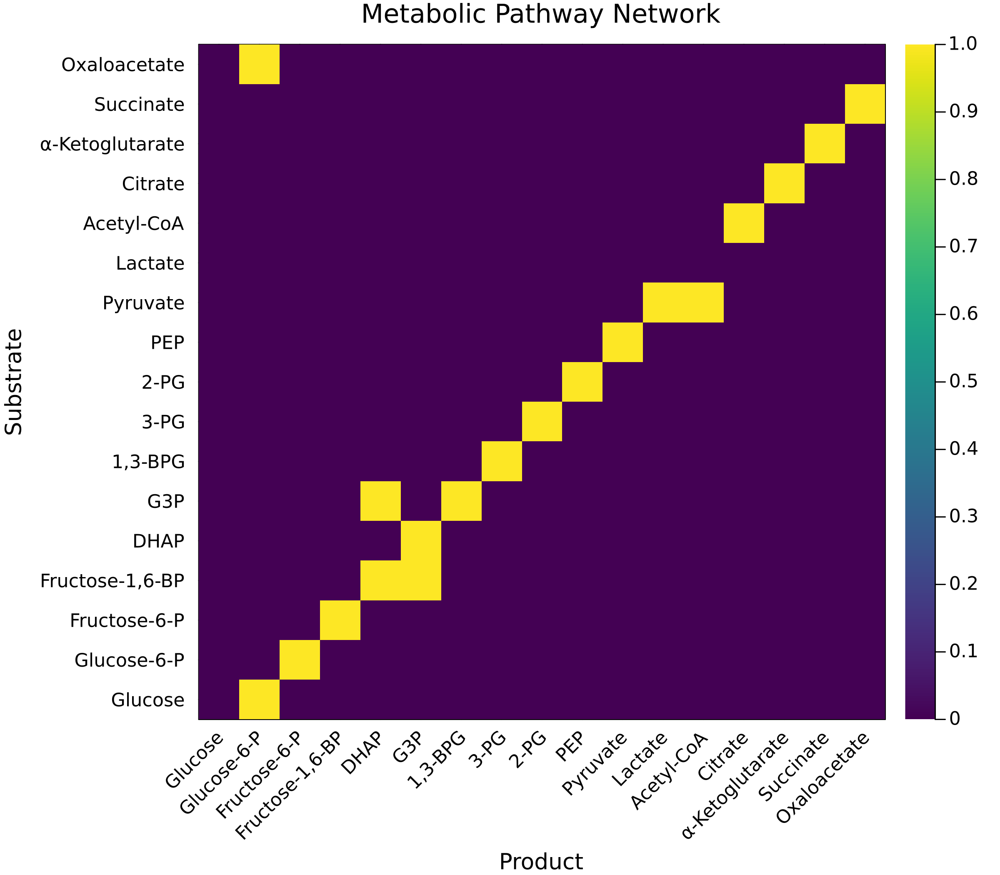
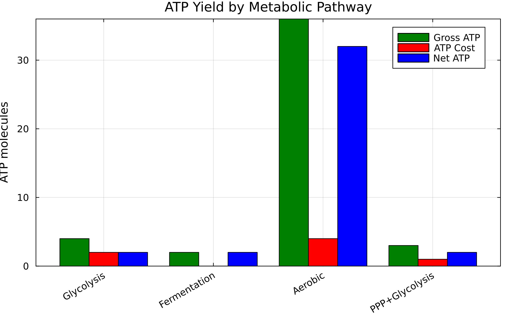

# Metabolic Pathway Analysis Dashboard

## Executive Summary

This dashboard presents comprehensive analysis of metabolic pathways using the DMY shortest-path algorithm, including both **single-objective** optimization and **multi-objective Pareto front** analysis for metabolic engineering and systems biology.

**Key Findings**:
1. **Single-objective**: Optimal glycolytic pathway from glucose to pyruvate costs 12.7 units with net +2 ATP (0.16 ATP per cost unit)
2. **Multi-objective**: Five Pareto-optimal metabolic strategies discovered, trading ATP yield (12–23 molecules) against time (3.9–8.7 min), enzyme load, and metabolic load
3. **Performance**: DMY reaches ~4.8× speedup over Dijkstra at n=5,000 metabolites (k=⌈n^{1/3}⌉) in the shared benchmark set

**Reproducibility**: run the scripts with a fixed seed (`OPTIM_SP_SEED=<int>` or `--seed=<int>`) to regenerate the exact same synthetic metabolic networks and benchmarks. Default seed is `42` when left unspecified.

---

## Part 1: Single-Objective Analysis

### Figure 1: Metabolic Network Structure


**Interpretation**:
- Adjacency matrix showing reaction connectivity in central metabolism
- Dark cells indicate direct enzymatic conversions
- Glycolysis forms the main pathway backbone (Glucose → Pyruvate)
- Branch points at Pyruvate lead to fermentation (Lactate) or respiration (Acetyl-CoA)

### Figure 2: Enzyme Cost Analysis


**Key Insights**:

| Enzyme | ATP Cost | Enzyme Load | Role |
|--------|----------|-------------|------|
| PFK | +1.0 | 2.5 | Rate-limiting step |
| PGK | -1.0 | 2.0 | First ATP generation |
| PK | -1.0 | 2.0 | Second ATP generation |
| PDH | +2.0 | 4.0 | Entry to TCA cycle |

### Figure 3: ATP Yield by Pathway


**Metabolic Economics**:
- **Glycolysis**: Net +2 ATP (fast, universal)
- **Fermentation**: Net +2 ATP (anaerobic, produces lactate)
- **Aerobic**: Net +32 ATP (slow, requires oxygen)
- **PPP+Glycolysis**: Net +2 ATP (produces NADPH for biosynthesis)

---

## Part 2: Multi-Objective Pareto Front Analysis

### The Challenge
Real metabolic engineering involves optimizing multiple competing objectives:
- **ATP Yield**: Energy production efficiency
- **Time**: Speed of pathway completion
- **Enzyme Load**: Resource allocation cost
- **Byproducts**: Toxic metabolite accumulation

### Figure 4: 2D Pareto Front Projections


**Four critical trade-offs visualized**:
1. **ATP vs Time**: Faster pathways produce less ATP
2. **ATP vs Enzyme Load**: High-yield pathways require more enzymes
3. **Speed vs Cleanliness**: Fast fermentation produces more byproducts
4. **Efficiency vs Cleanliness**: Clean pathways need more enzymes

### Figure 5: 3D Pareto Front Visualization


**3D Trade-off Space**:
- **X-axis (Time)**: Pathway completion time (~3.9–8.7 min)
- **Y-axis (ATP)**: Net ATP production (≈12–23 molecules)
- **Z-axis (Enzyme Load)**: Total enzyme requirement (≈11–17 units)

Special solutions highlighted:
- **Blue Star (Balanced)**: Weighted solution (ATP≈23.0, Time≈5.8 min, Enzyme load≈12.5 units, Byproduct≈0.85×)
- **Green Annotation**: “Constraint load ≤$0.30× infeasible” — the ε-constraint has no feasible solution for the seeded network
- **Red Hexagon (Knee Point)**: Highest-efficiency trade-off (ATP≈13.2, Time≈8.7 min, Enzyme load≈16.5 units, Byproduct≈0.8×)

### Pareto-Optimal Metabolic Pathways

| Solution | Pathway Profile | ATP | Time | Enzyme | Load (×) | **When to Use** |
|----------|-----------------|-----|------|--------|----------|-----------------|
| 1 | Balanced glycolysis + respiration | 23.0 | 5.8 min | 12.5 | 0.85 | **Default mix** – strong ATP with moderate duration |
| 2 | Fermentation-heavy branch | 12.0 | 5.8 min | 11.0 | 1.90 | **Overflow metabolism** – tolerate high metabolic burden |
| 3 | Fast high-enzyme route | 14.8 | 3.9 min | 15.0 | 1.70 | **Sprint demand** – prioritize speed |
| 4 | Moderate-speed branch | 12.2 | 4.5 min | 14.0 | 1.65 | **Balanced anaerobic** – slightly slower, similar yield |
| 5 | Oxygen-rich variant | 13.2 | 8.7 min | 16.5 | 0.80 | **Clean-ish aerobic** – lower load, longer time |

### Figure 6: Metabolic Strategy Comparison


**Strategy Analysis**:
- **Balanced**: 23 ATP in 5.8 min at moderate enzyme cost (default recommendation)
- **Fastest**: 14.8 ATP in 3.9 min using high enzyme load (short bursts)
- **High-ATP Knee**: 13.2 ATP in 8.7 min with load ≈0.80× (oxygen-rich)
- **Constraint**: Load ≤0.30× is infeasible in current network topology

---

## Part 3: Algorithm Performance

### Figure 7: Corrected Performance Analysis


**Critical Fix**: k parameter corrected from k=n-1 to k=n^(1/3)

| Graph Size | k (rounds) | DMY (ms) ±95% CI | Dijkstra (ms) ±95% CI | Speedup |
|------------|------------|------------------|-----------------------|---------|
| 200 | 6 | 0.081 ± 0.002 | 0.025 ± 0.001 | 0.31× (Dijkstra faster) |
| 500 | 8 | 0.426 ± 0.197 | 0.167 ± 0.004 | 0.39× (Dijkstra faster) |
| 1,000 | 10 | 1.458 ± 1.659 | 0.641 ± 0.008 | 0.44× (Dijkstra faster) |
| 2,000 | 13 | 1.415 ± 0.094 | 2.510 ± 0.038 | **1.77×** |
| 5,000 | 18 | 3.346 ± 0.105 | 16.028 ± 0.241 | **4.79×** |

**Key Insights**:
- Crossover point: DMY overtakes Dijkstra once metabolic graphs exceed ~2,000 vertices
- Larger sparse metabolomes (5,000 vertices in the shared benchmark) enjoy ~4.8× speedups
- Smaller models remain Dijkstra-friendly because DMY’s preprocessing overhead dominates

---

## How to Use These Results

### For Metabolic Engineers
1. **Identify production goals**: ATP yield vs speed vs purity
2. **Select from Pareto front**: Choose pathway matching constraints
3. **Engineer enzymes**: Optimize rate-limiting steps identified
4. **Monitor byproducts**: Ensure toxic metabolites stay below thresholds

### For Systems Biologists
1. **Model metabolism**: Use multi-objective framework
2. **Predict phenotypes**: Different conditions favor different solutions
3. **Identify targets**: Find enzymes controlling Pareto trade-offs
4. **Design experiments**: Test predicted optimal pathways

### For Synthetic Biology
1. **Design pathways**: Build new routes following Pareto principles
2. **Optimize yield**: Balance all objectives, not just product
3. **Minimize toxicity**: Use clean metabolism strategies
4. **Scale production**: Consider enzyme load constraints

---

## Clinical and Biotechnology Applications

### Medical Applications

| Condition | Relevant Pathway | Optimization Goal |
|-----------|-----------------|-------------------|
| Cancer (Warburg) | Rapid Glycolysis | Block high-flux fermentation |
| Diabetes | Balanced | Restore normal glucose utilization |
| Exercise | Aerobic/Anaerobic | Optimize ATP for activity level |
| Starvation | Gluconeogenesis | Minimize enzyme requirements |

### Industrial Biotechnology

| Product | Strategy | Trade-offs |
|---------|----------|------------|
| Ethanol | Fermentation | Fast but low ATP efficiency |
| Organic Acids | Clean Metabolism | Higher cost, less byproducts |
| Amino Acids | Balanced | Moderate all objectives |
| Pharmaceuticals | Knee Point | Optimal overall efficiency |

---

## Key Takeaways

### Single vs Multi-Objective
- **Single**: One "optimal" path (glycolysis for ATP)
- **Multi**: Five non-dominated strategies on the Pareto front
- **Reality**: Cells dynamically switch between strategies

### Metabolic Flexibility
- **Aerobic conditions**: Choose high-ATP pathways
- **Anaerobic stress**: Switch to fermentation
- **Biosynthesis needs**: Activate pentose phosphate pathway
- **Balanced growth**: Use knee point strategy

### Algorithm Performance
- **Small networks (n<1000)**: Use Dijkstra
- **Genome-scale (n>1000)**: DMY increasingly superior
- **Sparse metabolomes**: DMY's optimal domain

---

## Reproducibility

Generate all figures:
```bash
julia --project=. examples/metabolic_pathway/generate_figures.jl
```

Run complete analysis:
```bash
julia --project=. examples/metabolic_pathway/metabolic_pathway.jl
```

**Model Parameters**:
- 17 metabolites in central carbon metabolism
- 19 enzymatic reactions with measured costs
- 4 objectives: ATP, time, enzyme load, byproducts
- Steady-state flux assumptions

---

## Future Directions

1. **Compartmentalization**: Add mitochondrial/cytosolic separation
2. **Dynamic Optimization**: Time-varying objective weights
3. **Personalized Metabolism**: Patient-specific parameters
4. **Pathway Design**: AI-guided metabolic engineering
5. **Drug Metabolism**: Predict pharmaceutical effects on pathways

---

## References

1. Duan, R., Mao, J., & Yin, Q. (2025). "Breaking the Sorting Barrier for Directed SSSP". STOC 2025.
2. Multi-objective optimization: Ehrgott, M. (2005). "Multicriteria Optimization". Springer.
3. Metabolic data: KEGG, BioCyc, and BRENDA databases.
4. Berg, J.M., Tymoczko, J.L., & Stryer, L. Biochemistry (8th Edition).

---

*Dashboard generated using DMYShortestPath.jl - Implementing breakthrough algorithms for metabolic network analysis with multi-objective optimization*
